# 🚀 Backend Engineer → Top-Level Backend + DevOps Engineer

**Current:** Backend Engineer — APIs, Microservices, MCP, Docker, SQL (in progress)
**Goal:** Top-level Backend + DevOps Engineer in ~10–12 months
**Rule:** No phase starts until the previous phase's exit check passes. No unstructured jumping.

---

## 🗺️ Master Roadmap

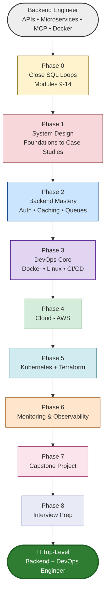

---

## 📅 Timeline (Gantt View)

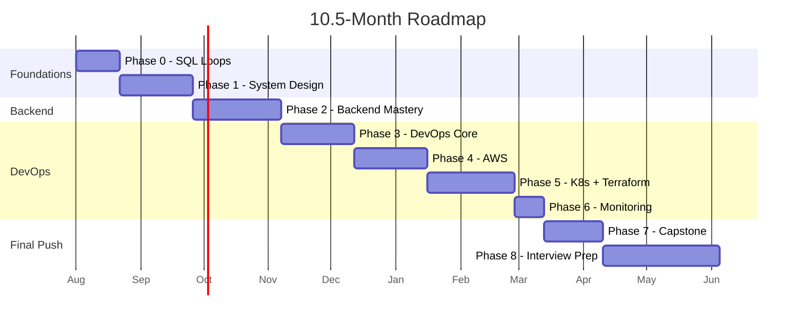

---

# ✅ Phase 0: Close SQL Loops (2–3 weeks)

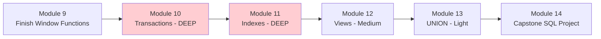

### 🔑 Key Points

- **Transactions** — ACID properties, isolation levels (Read Uncommitted → Serializable), BEGIN/COMMIT/ROLLBACK/SAVEPOINT. Money-transfer example is the classic interview scenario.
- **Indexes** — B-tree concept, composite index column order matters, EXPLAIN/EXPLAIN ANALYZE to read query plans, read-vs-write tradeoff.
- **Views** — simplifies complex joins, know updatable vs non-updatable limitation.
- **UNION** — UNION removes duplicates (slower), UNION ALL doesn't (faster); column count/type must match.

### 📚 Resources

- [Use The Index, Luke](https://use-the-index-luke.com/) — best free deep-dive on indexing
- [PostgreSQL official docs — Transactions](https://www.postgresql.org/docs/current/tutorial-transactions.html)
- [Mode SQL Tutorial — Window Functions &amp; Advanced](https://mode.com/sql-tutorial/)

**Exit check:** Write a transfer transaction + explain isolation levels + read an EXPLAIN output — all without notes.

---

# 🏗️ Phase 1: System Design (4–5 weeks)

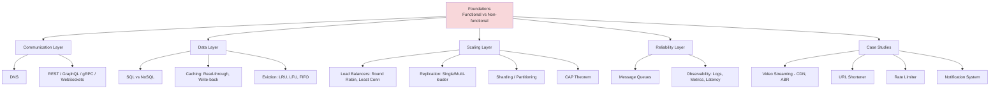

### 🔑 Key Points

- **Non-functional requirements** (scalability, availability, latency, consistency) matter as much as functional ones — always state them first in an interview.
- **CAP theorem** — pick 2 of 3 (Consistency, Availability, Partition tolerance); know real DB examples for each side.
- **Caching strategies** — cache-aside is most common in practice; know when write-through vs write-back applies.
- **Sharding vs Replication** — sharding scales writes, replication scales reads. Don't confuse them.
- Practice **explaining out loud**, not just knowing — this is the actual interview skill.

### 📚 Resources

- [System Design Primer (GitHub)](https://github.com/donnemartin/system-design-primer) — the most complete free resource
- [ByteByteGo — System Design Newsletter/YouTube](https://bytebytego.com/)
- [Designing Data-Intensive Applications (book, Martin Kleppmann)](https://dataintensive.net/) — the gold-standard reference, read relevant chapters as needed
- [High Scalability blog](http://highscalability.com/) — real-world architecture case studies

**Exit check:** Whiteboard 5 designs (video streaming + 4 classics) solo, in 15–20 min each, defending tradeoffs out loud.

---

# ⚙️ Phase 2: Backend Mastery (4–6 weeks)

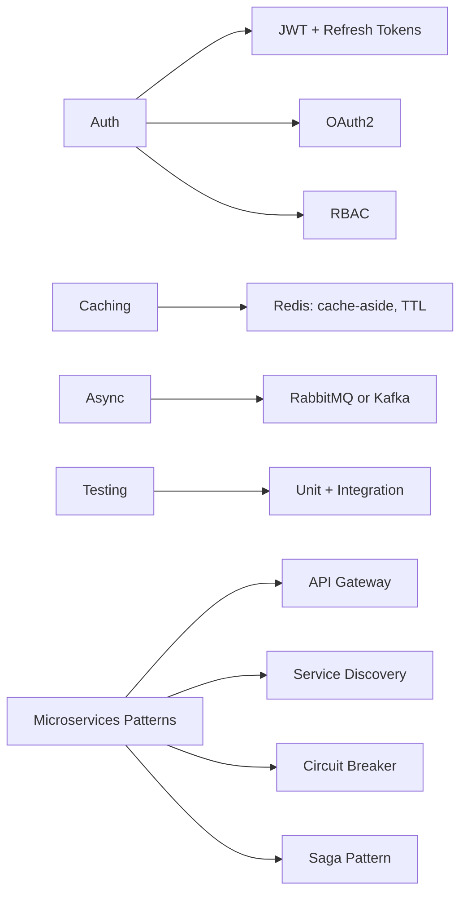

### 🔑 Key Points

- **JWT** — understand stateless auth tradeoffs vs sessions; refresh token rotation prevents long-lived token theft risk.
- **Redis caching** — cache-aside is the default pattern; always define TTL + invalidation strategy upfront.
- **Message queues** — decouples services, absorbs traffic spikes, enables async workflows (e.g. email sending, order processing).
- **Circuit breaker** — prevents cascading failures when a downstream service is down; you likely need this since you already work with microservices.
- **Saga pattern** — manages distributed transactions across microservices (since you can't do a single DB transaction across services).

### 📚 Resources

- [Redis University — free courses](https://university.redis.com/)
- [JWT.io — introduction + debugger](https://jwt.io/introduction)
- [Microservices.io — patterns catalog](https://microservices.io/patterns/index.html)
- [Kafka official docs — Quickstart](https://kafka.apache.org/quickstart)

**Exit check:** Add JWT auth + Redis caching + a circuit breaker to one of your existing microservices.

---

# 🐳 Phase 3: DevOps Core (5–6 weeks)

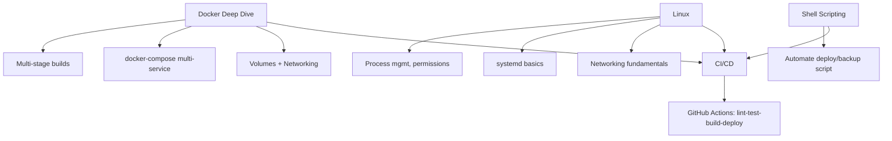

### 🔑 Key Points

- **Multi-stage Docker builds** — reduces final image size significantly, keeps build tools out of production image.
- **docker-compose** — define full local dev environment (app + DB + Redis + queue) in one file.
- **Linux fundamentals** — you'll debug production issues over SSH; comfort here is non-negotiable for DevOps roles.
- **CI/CD pipeline** — should run: lint → test → build → push image → deploy, triggered on every merge to main.

### 📚 Resources

- [Docker official — Multi-stage builds](https://docs.docker.com/build/building/multi-stage/)
- [GitHub Actions — official docs](https://docs.github.com/en/actions)
- [Linux Journey (free, interactive)](https://linuxjourney.com/)
- [Explainshell.com](https://explainshell.com/) — paste any shell command to understand it

**Exit check:** Containerize a project + write a GitHub Actions pipeline that auto-deploys on push to main.

---

# ☁️ Phase 4: Cloud — AWS (4–5 weeks)

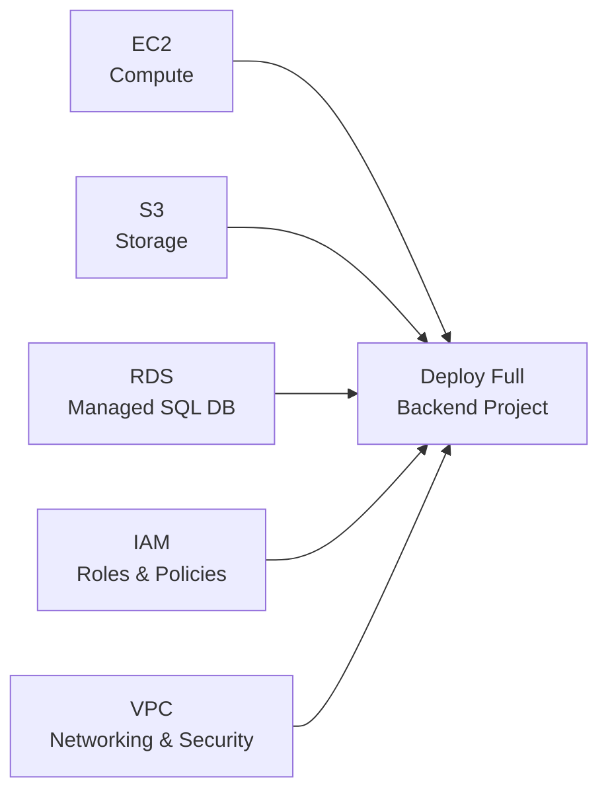

### 🔑 Key Points

- **EC2** — understand instance types, security groups (firewall rules), key pairs for SSH access.
- **RDS** — managed database removes backup/patching overhead; connects directly to your SQL knowledge.
- **IAM** — always follow least-privilege principle; this is a common interview + real-world mistake area.
- **VPC** — public vs private subnets, understand why your DB should sit in a private subnet, not public.

### 📚 Resources

- [AWS Free Tier](https://aws.amazon.com/free/) — hands-on practice, no cost within limits
- [AWS Skill Builder — free digital courses](https://skillbuilder.aws/)
- [FreeCodeCamp — AWS Certified Cloud Practitioner (YouTube, free)](https://www.youtube.com/freecodecamp)

**Exit check:** Deploy one existing backend project fully on AWS (EC2 + RDS + proper IAM roles + VPC setup).

---

# ☸️ Phase 5: Kubernetes + Infrastructure as Code (5–6 weeks)

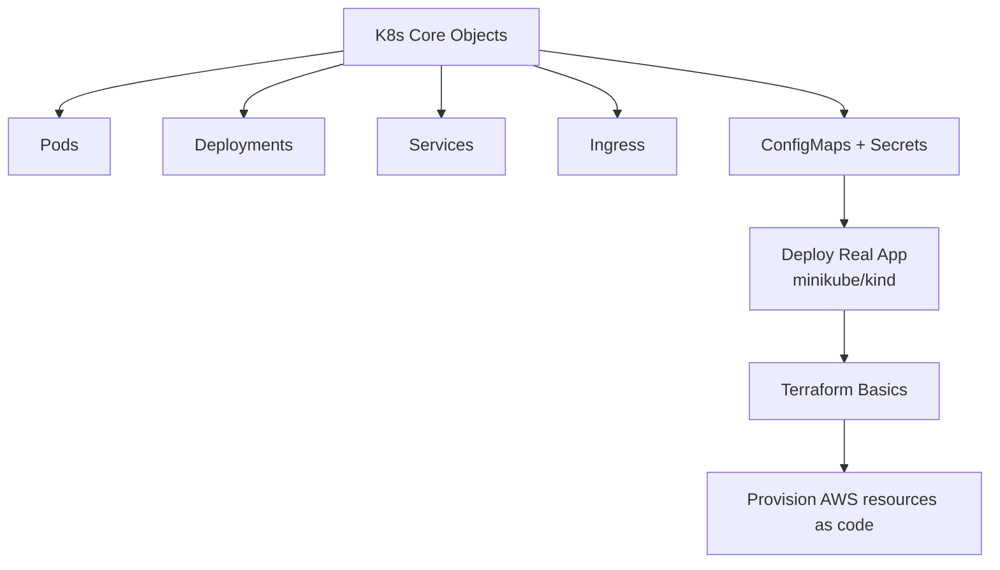

### 🔑 Key Points

- **Pods vs Deployments** — Deployment manages replica sets of Pods, enables rolling updates and self-healing.
- **Services** — ClusterIP, NodePort, LoadBalancer — know when to use each.
- **ConfigMaps/Secrets** — never hardcode config or credentials into container images.
- **Terraform** — infrastructure as code means your AWS setup from Phase 4 becomes reproducible and version-controlled.
- **Don't chase full mastery** — interviewers want "can you deploy and manage a real app," not certification depth.

### 📚 Resources

- [Kubernetes official docs — Tutorials](https://kubernetes.io/docs/tutorials/)
- [Killercoda — free interactive K8s scenarios](https://killercoda.com/kubernetes)
- [Terraform official — Get Started](https://developer.hashicorp.com/terraform/tutorials)
- [minikube](https://minikube.sigs.k8s.io/docs/start/) — local cluster for practice

**Exit check:** Deploy your Phase 4 AWS app to a local K8s cluster, then provision the AWS side with Terraform.

---

# 📊 Phase 6: Monitoring & Observability (2 weeks)

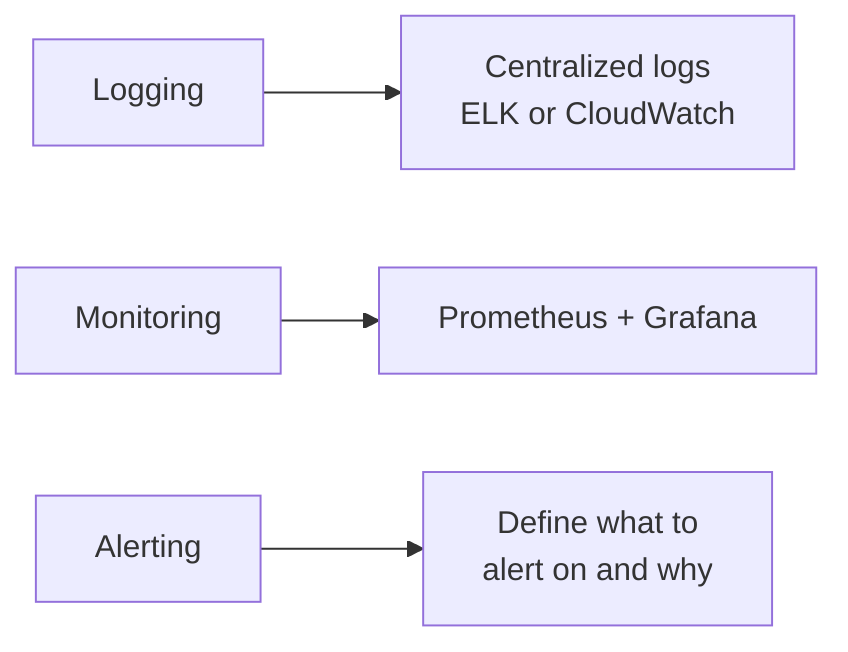

### 🔑 Key Points

- **Logs vs Metrics vs Traces** — know the difference; logs = events, metrics = numbers over time, traces = request journeys across services.
- **Prometheus + Grafana** — the industry-standard open source combo; Prometheus scrapes metrics, Grafana visualizes.
- **Alert fatigue** — alert only on things that need human action; too many alerts = ignored alerts.

### 📚 Resources

- [Prometheus official docs](https://prometheus.io/docs/introduction/overview/)
- [Grafana — Getting Started](https://grafana.com/docs/grafana/latest/getting-started/)
- [Google SRE Book — free online](https://sre.google/sre-book/table-of-contents/)

**Exit check:** Set up Prometheus + Grafana dashboard for your capstone project showing at least 3 real metrics.

---

# 🎯 Phase 7: Capstone Project (3–4 weeks)

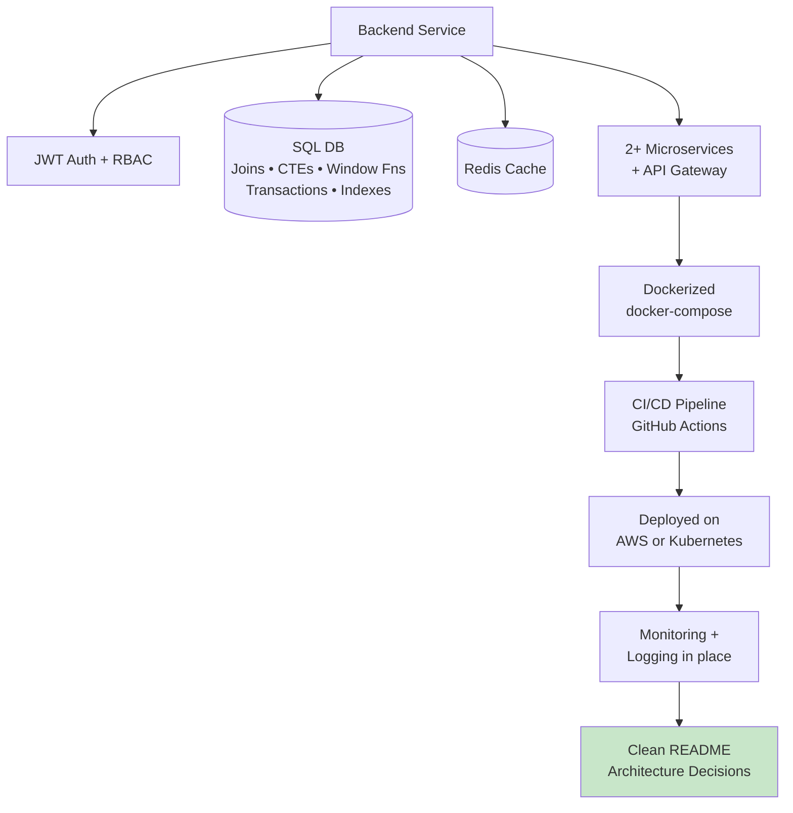

**One strong project > five shallow ones.** This becomes your #1 interview talking point — practice explaining every box in this diagram out loud.

---

# 🧠 Phase 8: Interview Prep (6–8 weeks)

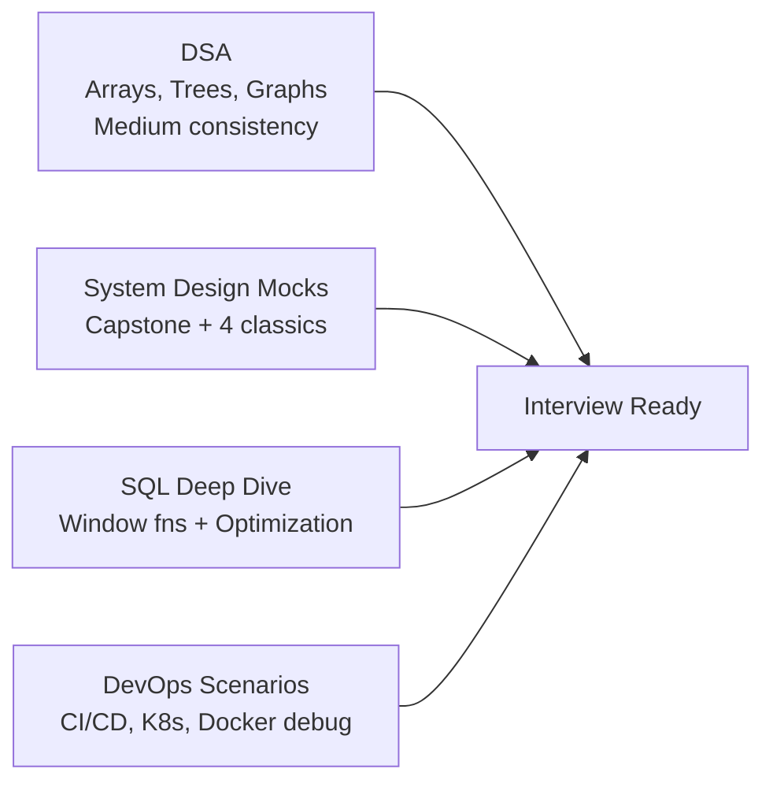

### 📚 Resources

- [NeetCode 150 (free, structured DSA)](https://neetcode.io/)
- [Pramp — free peer mock interviews](https://www.pramp.com/)
- [LeetCode — SQL + DSA problems](https://leetcode.com/)

**Exit check:** Complete at least 3 mock interviews (technical + system design) before applying.

---

## 🔑 Golden Rules

1. No phase starts until the previous phase's exit check passes.
2. One cloud provider only (AWS) — don't split focus.
3. Real deployed projects > certifications.
4. Every phase feeds into your capstone project — treat it as living, not a one-time build.
5. Review this roadmap weekly, check off progress honestly.
