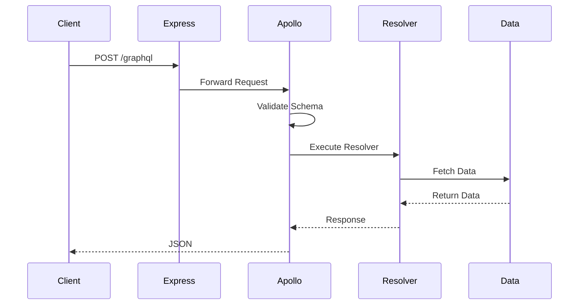
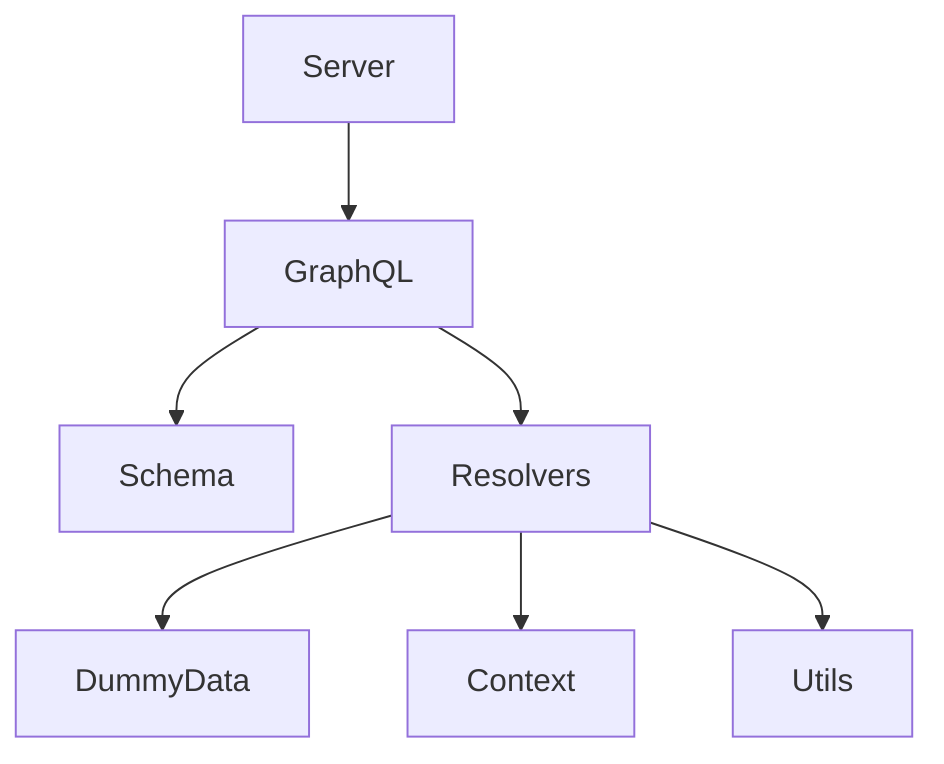
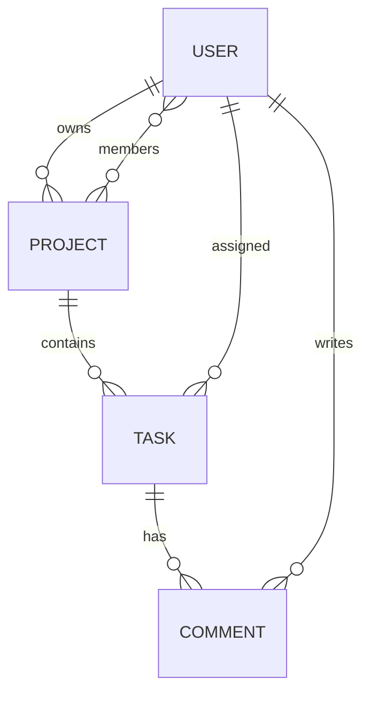

# 🚀 GraphQL Backend Mastery

> Build a Production-Ready GraphQL Backend using **Express + Apollo Server + GraphQL**.
>
> **Goal:** Learn GraphQL by building a real-world backend instead of isolated examples.

---

# 📖 Project Objective

This project is designed to simulate how GraphQL is used in real companies.

Instead of learning GraphQL syntax alone, we will build a complete backend step by step.

Initially, we **won't use a database**.

We'll use **dummy data** so we can focus entirely on understanding:

- GraphQL
- Schema Design
- Resolvers
- Relationships
- Queries
- Mutations

Later, we'll replace the dummy data with MongoDB without changing the API design.

---

# 🎯 Learning Goals

By the end of this project, you should be able to:

- Understand GraphQL architecture
- Build GraphQL APIs from scratch
- Design GraphQL schemas
- Write Queries
- Write Mutations
- Understand Resolvers
- Handle Nested Relationships
- Implement Authentication
- Connect MongoDB
- Build Production Ready APIs

---

# 🛠 Tech Stack

```
Node.js
Express.js
Apollo Server
GraphQL

(No Database Initially)

Later:

MongoDB
Mongoose
JWT
Redis (Optional)
```

---

# 📂 Project Structure

```
graphql-project/

│
├── package.json
├── server.js
│
└── src
    │
    ├── graphql
    │   │
    │   ├── schema
    │   │     ├── typeDefs.js
    │   │     └── index.js
    │   │
    │   ├── resolvers
    │   │     ├── Query.js
    │   │     ├── Mutation.js
    │   │     ├── User.js
    │   │     ├── Project.js
    │   │     ├── Task.js
    │   │     ├── Comment.js
    │   │     └── index.js
    │   │
    │   ├── data
    │   │     ├── users.js
    │   │     ├── projects.js
    │   │     ├── tasks.js
    │   │     └── comments.js
    │   │
    │   ├── context
    │   │     └── index.js
    │   │
    │   └── utils
    │
    └── README.md
```

---

# 🏗 High Level Architecture

```mermaid
flowchart TD

Client

↓

Express Server

↓

Apollo Server

↓

GraphQL Schema

↓

Resolvers

↓

Dummy Data

↓

JSON Response
```

---

# 🔄 Request Lifecycle



---

# 📦 Folder Responsibility



---

# 🧠 Data Model

## User

```
id
name
email
role
```

---

## Project

```
id
title
description
ownerId
memberIds[]
```

---

## Task

```
id
title
status
priority
assignedTo
projectId
```

---

## Comment

```
id
text
taskId
userId
```

---

# 🔗 Entity Relationship



---

# 📡 GraphQL Schema Relationships

```text
User

├── Projects

├── Tasks

└── Comments

Project

├── Owner

├── Members

└── Tasks

Task

├── Assigned User

├── Project

└── Comments

Comment

├── User

└── Task
```

---

# 🔍 Queries

## Users

```
users

user(id)
```

---

## Projects

```
projects

project(id)
```

---

## Tasks

```
tasks

task(id)
```

---

## Comments

```
comments

comment(id)
```

---

# ✍️ Mutations

```
createUser

updateUser

deleteUser
```

```
createProject

updateProject

deleteProject
```

```
createTask

updateTask

deleteTask
```

```
createComment

deleteComment
```

---

# 📚 Learning Roadmap

## Phase 1

- Project Setup
- Express
- Apollo Server
- GraphQL Basics

---

## Phase 2

- Schema
- Types
- Scalars
- Queries

---

## Phase 3

- Resolvers
- Arguments
- Variables

---

## Phase 4

- Mutations
- Input Types
- Validation

---

## Phase 5

- Relationships
- Nested Queries
- Context

---

## Phase 6

Replace Dummy Data

↓

MongoDB

↓

Mongoose

↓

Async Resolvers

---

## Phase 7

Authentication

Authorization

JWT

Protected Routes

---

## Phase 8

Pagination

Filtering

Sorting

Search

Error Handling

Performance

---

# 🧭 Request Flow

```mermaid
flowchart LR

React

-->

POST /graphql

-->

Express

-->

Apollo Server

-->

Schema

-->

Resolver

-->

Dummy Data

-->

Response
```

---

# 🚀 Future Upgrade

```
Dummy Data

↓

MongoDB

↓

Redis Cache

↓

Authentication

↓

Authorization

↓

Production Deployment
```

---

# 📋 Development Checklist

## Phase 1

- [ ] Setup Project
- [ ] Install Packages
- [ ] Express Server
- [ ] Apollo Server
- [ ] First GraphQL Query

---

## Phase 2

- [ ] Schema
- [ ] Types
- [ ] Resolvers

---

## Phase 3

- [ ] CRUD Operations
- [ ] Relationships

---

## Phase 4

- [ ] MongoDB Integration

---

## Phase 5

- [ ] JWT Authentication

---

## Phase 6

- [ ] Production Best Practices

---

# 🎯 Final Goal

By completing this project, you'll be able to:

- Build GraphQL APIs confidently.
- Understand how GraphQL integrates with Express.
- Design scalable GraphQL schemas.
- Replace mock data with databases easily.
- Transition from REST to GraphQL in a production codebase.
- Work on GraphQL-based backend projects in the industry.
