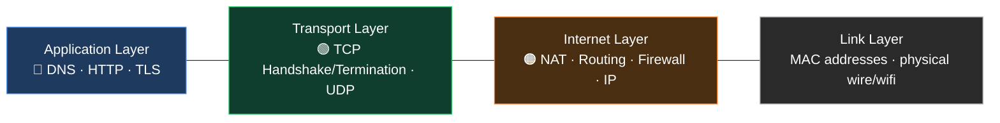

# The Journey of a Request — Master Networking Diagram

> **How to read this:** Follow the flow left → right. This is literally what happens,
> in order, the moment you type a URL and hit Enter. Every concept sits exactly where it
> happens in real life — nothing here is a random floating definition.

---

## 🗺️ The Full Journey (Master Diagram)

```mermaid
flowchart LR

    %% ===================== ZONE 1: DNS =====================
    subgraph Z1["🔵 ZONE 1 — DNS Resolution (Application Layer)"]
        direction TB
        A1["Browser needs<br/>example.com → IP"]
        A2["Recursive Resolver<br/>(ISP / 8.8.8.8)"]
        A3["Root Server<br/>'.' "]
        A4["TLD Server<br/>'.com'"]
        A5["Authoritative<br/>Nameserver"]
        A6["IP Address<br/>returned to browser"]
        A1 --> A2 --> A3 --> A4 --> A5 --> A6
        A7["Record types:<br/>A · AAAA · CNAME · MX"]
        A6 -.-> A7
    end

    %% ===================== ZONE 2: TCP HANDSHAKE =====================
    subgraph Z2["🟢 ZONE 2 — TCP 3-Way Handshake (Transport Layer)"]
        direction TB
        B1["Client → SYN<br/>(seq=x)"]
        B2["Server → SYN-ACK<br/>(seq=y, ack=x+1)"]
        B3["Client → ACK<br/>(seq=x+1, ack=y+1)"]
        B1 --> B2 --> B3
        B4["⚡ UDP alternative:<br/>NO handshake —<br/>connectionless, fire & forget"]
    end

    %% ===================== ZONE 3: TLS =====================
    subgraph Z3["🟣 ZONE 3 — TLS Handshake (HTTPS Security)"]
        direction TB
        C1["Client Hello<br/>(supported ciphers)"]
        C2["Server Hello +<br/>Certificate (CA-signed)"]
        C3["Key Exchange →<br/>Symmetric Session Key"]
        C4["🔒 Encrypted<br/>channel ready"]
        C1 --> C2 --> C3 --> C4
    end

    %% ===================== ZONE 4: HTTP =====================
    subgraph Z4["🔵 ZONE 4 — HTTP Request / Response (Application Layer)"]
        direction TB
        D1["Request:<br/>GET /path<br/>Headers + Body"]
        D2["Response:<br/>200 OK<br/>Headers + Body"]
        D1 --> D2
    end

    %% ===================== ZONE 5: NETWORK PATH =====================
    subgraph Z5["🟠 ZONE 5 — Network Path (Internet / Infra Layer)"]
        direction TB
        E1["NAT<br/>private IP → public IP"]
        E2["Firewall<br/>allow/deny by port+rule"]
        E3["Load Balancer<br/>1 request → N servers"]
        E4["Reverse Proxy<br/>(often same box as LB)"]
        E5["Ports in play:<br/>80/443 HTTP · 53 DNS · 22 SSH"]
        E1 --> E2 --> E3 --> E4
        E4 -.-> E5
        E6["🩺 ping / ICMP —<br/>diagnostic tool for this layer"]
        E2 -.-> E6
    end

    %% ===================== ZONE 6: SERVER =====================
    subgraph Z6["⚙️ ZONE 6 — Server"]
        F1["App server processes<br/>request, builds response"]
    end

    %% ===================== ZONE 7: TERMINATION =====================
    subgraph Z7["🟢 ZONE 7 — TCP 4-Way Termination (Transport Layer)"]
        direction TB
        G1["Client → FIN"]
        G2["Server → ACK"]
        G3["Server → FIN"]
        G4["Client → ACK"]
        G1 --> G2 --> G3 --> G4
    end

    %% ===================== MASTER FLOW =====================
    Z1 ==> Z2 ==> Z3 ==> Z4 ==> Z5 ==> Z6 ==> Z4b["Response travels back"] ==> Z7

    %% ===================== STYLES =====================
    classDef dns fill:#1e3a5f,stroke:#3b82f6,color:#fff
    classDef tcp fill:#0f3d2e,stroke:#22c55e,color:#fff
    classDef tls fill:#3b1f4a,stroke:#a855f7,color:#fff
    classDef infra fill:#4a2e12,stroke:#f97316,color:#fff
    classDef server fill:#2a2a2a,stroke:#9ca3af,color:#fff

    class A1,A2,A3,A4,A5,A6,A7,D1,D2 dns
    class B1,B2,B3,B4,G1,G2,G3,G4 tcp
    class C1,C2,C3,C4 tls
    class E1,E2,E3,E4,E5,E6 infra
    class F1,Z4b server
```

---

## 🧭 OSI / TCP-IP Layer Reference Strip

*Which zone above belongs to which layer — this is the "map key" for the diagram above.*

---

## 🔑 Legend

| Symbol / Style          | Meaning                                                      |
| ----------------------- | ------------------------------------------------------------ |
| `==>` (bold arrow)    | Master flow — the main left-to-right journey                |
| `-->` (solid arrow)   | Data / control flow within a zone                            |
| `-.->` (dashed arrow) | Side-note or supporting detail, not part of main sequence    |
| 🔵 Blue                 | Application layer concepts (DNS, HTTP, TLS)                  |
| 🟢 Green                | Transport layer concepts (TCP handshake/termination, UDP)    |
| 🟣 Purple               | Security / encryption (TLS specifically)                     |
| 🟠 Orange               | Internet/infra layer (NAT, firewall, load balancer, routing) |
| ⚙️ Gray               | Server-side processing                                       |

---

## 📎 Grounded In Your Existing Notes

This diagram's sequencing and terminology matches what's already documented in this repo —
no invented or conflicting explanations:

- Zone 2 & 7 → `Transport_Layer/TCP/Three-Way-Handshake.md`,
  `TCP-Sequence-and-Acknowledgement.md`, `Four_Way_Termination_Connection.md`
- UDP callout in Zone 2 → `Transport_Layer/UDP/UDP.MD`, `UDP_DATAGRAM.MD`
- Zone 1 (DNS chain) → confirmed by your own `wireShark/nslookup_for_dns_query_direct_google_server.png`
- Zone 5 (source/destination behavior) → confirmed by your own
  `wireShark/sorceBecomeDestination.png`, `sourceIp.png`
- ICMP side-note in Zone 5 → `PING.MD`

---

## ❌ Deliberately Left Out (by design, not oversight)

- **Subnetting / CIDR math** — a deeper topic, deserves its own focused diagram later
- **VPN, service mesh, Kubernetes networking (CNI/ingress)** — cloud-networking layered *on top*
  of these fundamentals; add as a follow-up diagram once this base is solid
- Ten separate disconnected diagrams — the whole point here is ONE continuous story
