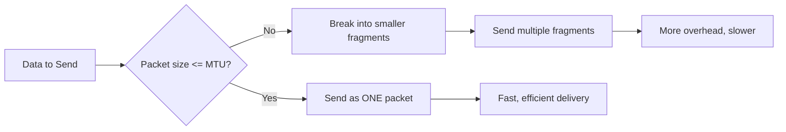
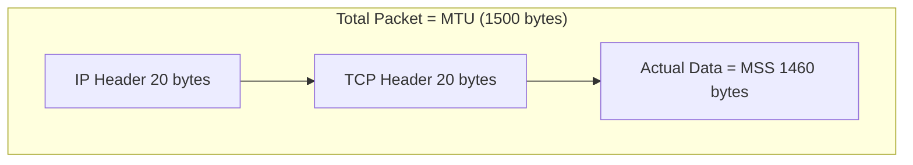
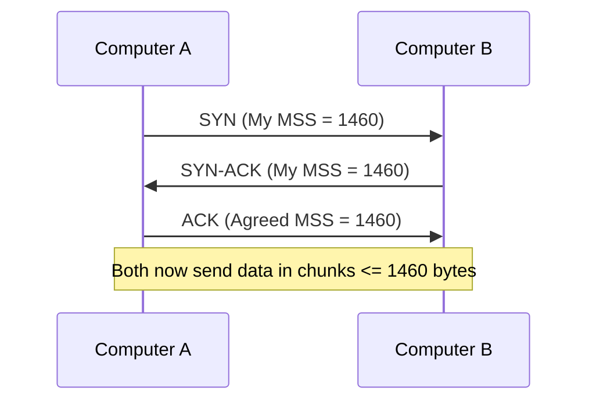
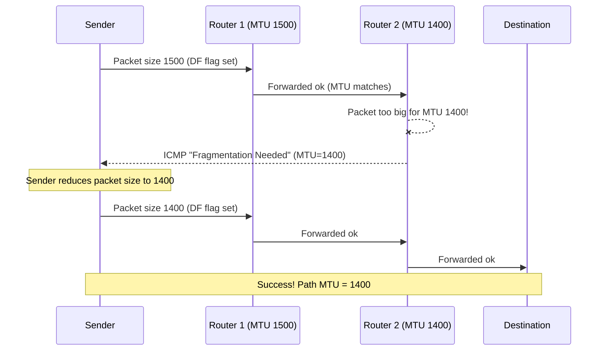
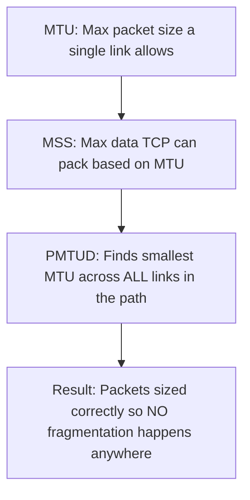

# Networking Basics: MTU, MSS, and PMTUD

Simple notes to understand how data is sized and sent across a network without unnecessary breaking (fragmentation).

---

## 1. MTU (Maximum Transmission Unit)

**Simple meaning:** MTU is the **biggest size of one packet** that a network link (like your Wi-Fi or Ethernet cable) allows to pass through at once.

- Standard MTU size = **1500 bytes** (most common on Ethernet/Wi-Fi)
- This 1500 bytes includes **everything**: headers + actual data
- If a packet is bigger than the MTU, it must be **broken into smaller pieces** (this is called fragmentation)
- Fragmentation is bad because it adds extra work (overhead) and slows things down

**Key Points:**

- MTU = limit set by the network link (cable/router/wifi)
- Measured in bytes
- 1500 bytes is the typical default
- Bigger packet than MTU → gets fragmented → less efficient



---

## 2. MSS (Maximum Segment Size)

**Simple meaning:** MSS is the **maximum amount of real data (payload only)** that TCP can pack inside one segment, so that after adding headers, it still fits inside the MTU.

**Formula:**

```
MSS = MTU - IP Header - TCP Header
```

Example with standard sizes:

```
MSS = 1500 - 20 (IP header) - 20 (TCP header) = 1460 bytes
```

- MSS only cares about the **actual data**, not the headers
- Both computers agree on the MSS value **during the TCP handshake** (the initial connection setup)
- This way, once data starts flowing, it already fits perfectly — no need to fragment later

**Key Points:**

- MSS = data-only limit (no headers counted)
- Calculated from MTU minus header sizes
- Agreed upon during TCP 3-way handshake
- Goal: avoid fragmentation before it even happens





---

## 3. PMTUD (Path MTU Discovery)

**Simple meaning:** Data doesn't travel directly — it hops through many routers to reach its destination. Each router along the way might have a **different MTU**. PMTUD is the process of finding the **smallest MTU in the whole path**, so packets never need to be fragmented anywhere along the route.

**How it works step by step:**

1. Sender sets a special flag called **DF (Don't Fragment)** in the IP header
2. Sender sends the packet at its own MTU size
3. If a router in the path has a **smaller MTU** and cannot forward the packet as-is:
   - Because of the DF flag, the router **cannot break it into pieces**
   - So the router **drops the packet**
   - The router sends back an **ICMP "Fragmentation Needed" message** to the sender
4. The sender **reduces the packet size** and tries again
5. This repeats until the packet successfully travels through **every router** in the path
6. The final working size = **Path MTU** (the smallest MTU among all the links in that route)

**Key Points:**

- Finds the smallest MTU across the entire path (not just one link)
- Uses the "Don't Fragment" (DF) flag
- Relies on ICMP messages from routers to inform the sender
- Sender keeps shrinking packet size until it succeeds
- End result: no fragmentation needed anywhere on the route



---

## How All Three Connect Together



---

## Quick Summary Table

| Concept         | What it Controls                                   | Where it Applies                           |
| --------------- | -------------------------------------------------- | ------------------------------------------ |
| **MTU**   | Max size of a whole packet                         | One single network link                    |
| **MSS**   | Max size of actual data (payload) in a TCP segment | Agreed between two devices (TCP handshake) |
| **PMTUD** | Finds smallest MTU across the whole path           | Entire route (multiple routers)            |

**One-line takeaway:** MTU sets the limit on one link, MSS makes sure TCP data fits inside that limit, and PMTUD checks the whole journey so packets never get stuck or fragmented anywhere in between.
