# 🌐 Networking Revision Notes (DevOps Prep)

> Ye file teri daily revision ke liye hai. Jo jo topic tune abhi tak cover kiya hai, sab yahan flow me hai — **Network → Host → MAC vs IP → Switch → CIDR → Subnet Mask → OSI Model → TCP/IP Model → Packet Journey → ARP**.

---

## 1. What is a NETWORK?

> **Network = Ek "Area" (Mohalla) jo multiple devices (Hosts) ko aapas me jodta hai.**

- Jaise ek gali me multiple ghar hote hain, waise hi ek network me multiple devices (phones, laptops, printers) hote hain.
- **Sabse important baat:** Ek hi network me sab devices ka **Network part (pehle 3 octets)** same hota hai. Isi se unhe pata chalta hai ki "Hum ek hi mohalle me rehte hain".

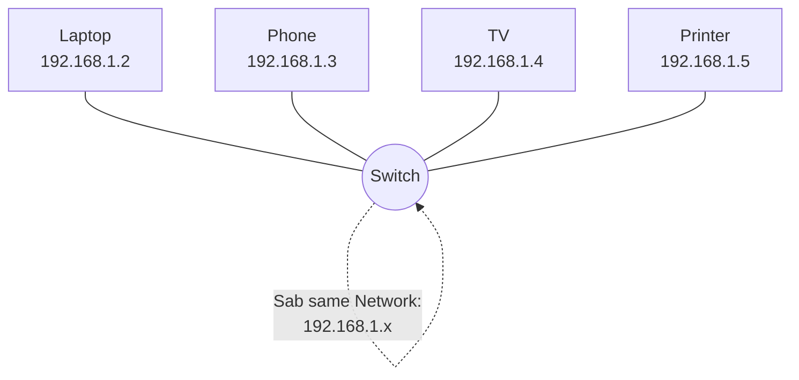

---

## 2. What is a HOST?

> **Host = Ek single system (ek device)** jo data **bhejta** ya **receive** karta hai.

- **Sabse important baat:** Ek host (jaise tera phone) **multiple networks** se ek saath connect ho sakta hai! (Ghar ka Wi-Fi, office ka VPN, Mobile Data — teeno ek saath).

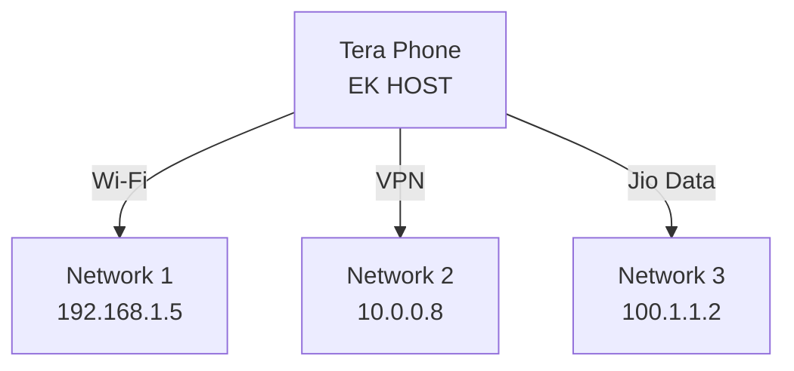

---

## 3. MAC Address vs IP Address

> **MAC Address = Physical Identity** teri machine ki (jaise tera Aadhar card — kabhi nahi badalta).
> **IP Address = Logical Identity** (jaise tera current ghar ka address — badal sakta hai).

| Point            | MAC Address                                 | IP Address                                  |
| ---------------- | ------------------------------------------- | ------------------------------------------- |
| Type             | Physical (Hardware)                         | Logical                                     |
| Diya kisne       | NIC manufacturer ne (burned-in)             | Network/Router ne (DHCP)                    |
| Change hota hai? | ❌ Nahi (mostly fixed)                      | ✅ Haan (network badalte hi badal jata hai) |
| Kaam             | Same network ke andar device identify karna | Ek network se dusre network tak route karna |
| Example          | `A4:C3:F0:85:AC:2D`                       | `192.168.1.10`                            |

> ⚡ **Yaad rakhne wali line:** *"IP CAN CHANGE, BUT MAC ALWAYS REMAINS SAME."*

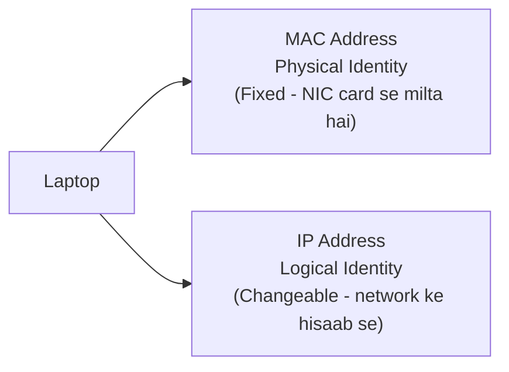

---

## 4. What is a SWITCH?

> **Switch = Ek device jo ek hi network (LAN) ke andar sab devices ko connect karta hai, aur data ko sahi device tak bhejta hai — MAC address use karke.**

- Switch **MAC address table** maintain karta hai — kaunsa device kis port pe connected hai.
- Jab data aata hai, switch check karta hai destination MAC address, aur sirf **usi port** pe data bhejta hai (poore network me broadcast nahi karta jaisa hub karta tha).

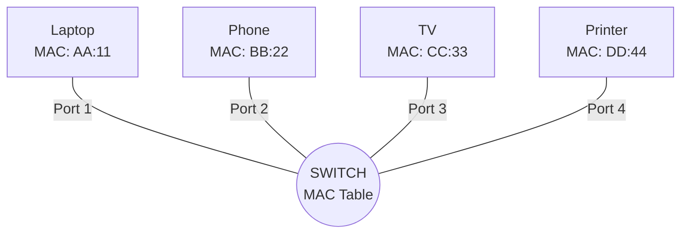

> 💡 **Switch vs Router (quick note):** Switch same network (LAN) ke andar MAC address se data bhejta hai. Router alag-alag networks ke beech IP address se data route karta hai.

---

## 5. What is CIDR? (Classless Inter-Domain Routing)

> **CIDR ek "notation" hai jo batata hai ki IP address ka kaunsa hissa NETWORK hai aur kaunsa HOST hai.**

- **Kaam:** Batata hai ki **Network kahan khatam hota hai** aur **Host kahan shuru hota hai**.
- **Fayda:** Router confuse nahi hota — usko pata chal jata hai ki packet kis network ke liye hai.

### CIDR Notation: `IP_Address / Number`

Example: `192.168.1.0/24`

- **`/24`** = pehle 24 bits (3 octets) **NETWORK**
- Baaki 8 bits (1 octet) **HOST**

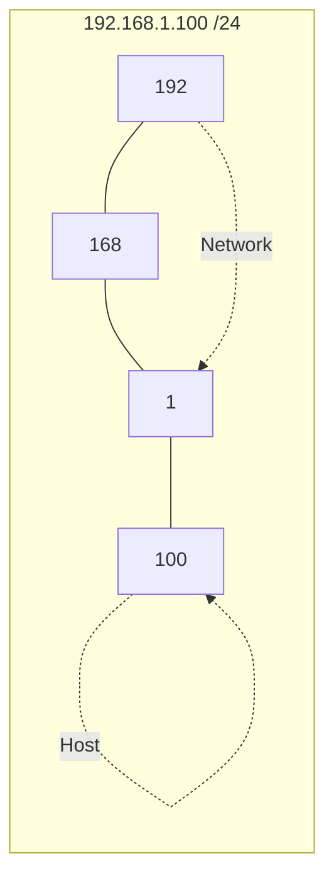

### Router Confusion Door Karna:

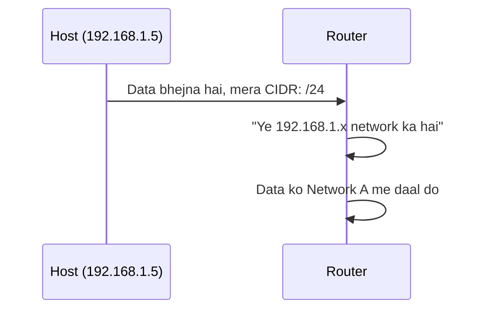

---

## 6. What is Subnet Mask?

> **Subnet Mask CIDR ka hi "dusra roop" hai — same cheez, alag likhne ka tareeka.**

- `/24` ko subnet mask me likhte hain: **`255.255.255.0`**
- Subnet Mask batata hai kaunse bits **Network** hain (1s) aur kaunse **Host** hain (0s).

| CIDR | Subnet Mask     | Network Bits | Host Bits | Total Usable Hosts |
| ---- | --------------- | ------------ | --------- | ------------------ |
| /24  | 255.255.255.0   | 24           | 8         | 254                |
| /16  | 255.255.0.0     | 16           | 16        | 65,534             |
| /29  | 255.255.255.248 | 29           | 3         | 6                  |

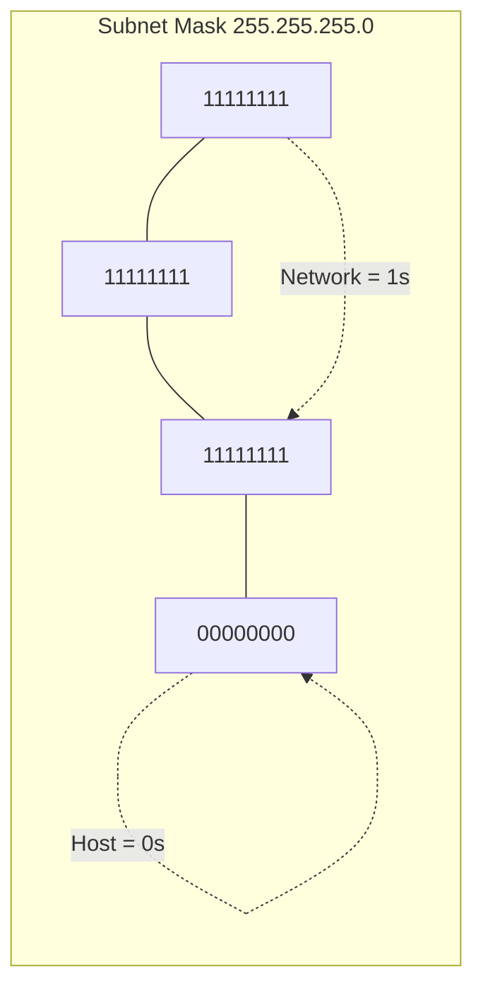

> 💡 **Real life example:** Agar tere ghar me sirf 5 devices hain, poora `/24` (254 IPs) waste hoga. `/29` use karke sirf 6 IPs milti hain — CIDR + Subnet Mask dono milke IPs bachate hain.

---

## 7. OSI Model (7 Layers)

> **OSI Model = Ek theoretical blueprint jo batata hai ki data kaise ek device se dusre device tak travel karta hai — 7 layers me divide karke.**

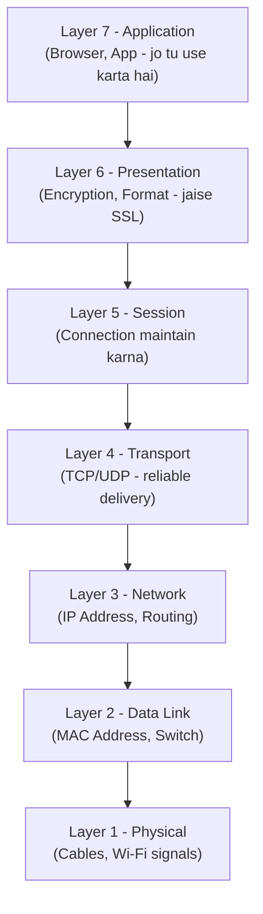

| Layer | Naam         | Kaam                                    | Example               |
| ----- | ------------ | --------------------------------------- | --------------------- |
| 7     | Application  | User ke sath interact karta hai         | Chrome, WhatsApp      |
| 6     | Presentation | Data ko format/encrypt karta hai        | SSL/TLS               |
| 5     | Session      | Connection start/maintain/end karta hai | Login session         |
| 4     | Transport    | Reliable data delivery                  | TCP, UDP              |
| 3     | Network      | IP address se routing                   | Router                |
| 2     | Data Link    | MAC address se local delivery           | Switch                |
| 1     | Physical     | Actual signal/cable/wifi                | Ethernet cable, Wi-Fi |

> 🧠 **Yaad rakhne ka trick:** **A**ll **P**eople **S**eem **T**o **N**eed **D**ata **P**rocessing (Application → Physical, top to bottom)

---

## 8. TCP/IP Model (4 Layers)

> **TCP/IP Model = OSI ka "practical version" jo real duniya me actually use hota hai (Internet isi pe chalta hai). OSI ke 7 layers ko simplify karke 4 me daal diya.**

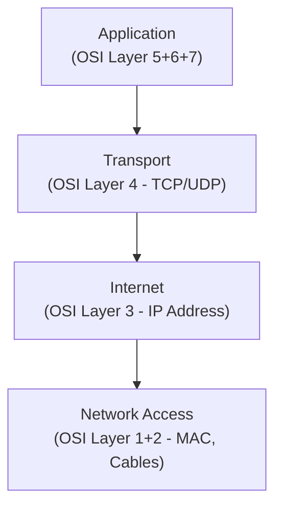

| TCP/IP Layer   | OSI Layers Combined | Kaam                            |
| -------------- | ------------------- | ------------------------------- |
| Application    | 5, 6, 7             | User apps, data format, session |
| Transport      | 4                   | TCP/UDP - reliable delivery     |
| Internet       | 3                   | IP addressing, routing          |
| Network Access | 1, 2                | MAC address, physical cables    |

---

## 9. Source IP se Destination IP tak Data Kaise Jaata Hai (Packet Journey)

> Ab sab kuch jodte hain — Host, MAC, IP, Switch, CIDR, OSI/TCP layers — ek real packet journey me.

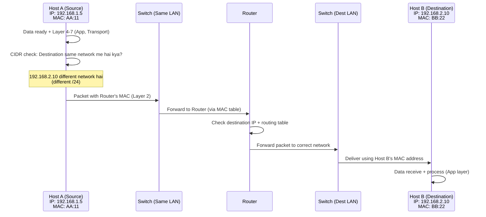

### Step-by-step (Simple words):

1. **Application Layer** pe data create hota hai (jaise browser se request).
2. **Transport Layer** (TCP) data ko chote packets me todta hai, reliable delivery ensure karta hai.
3. **Network Layer** pe **Source IP aur Destination IP** attach hote hain. CIDR/Subnet Mask check hota hai ki destination **same network** me hai ya **different network** me.
4. Agar same network me hai → seedha **Switch** ke through **MAC address** se deliver ho jata hai.
5. Agar different network me hai → packet **Router** ke paas jata hai (Router ka MAC address use hota hai locally, but IP wahi rehta hai destination ka).
6. Router apni **routing table** dekhta hai aur packet ko sahi network ki taraf forward karta hai.
7. Destination network ka **Switch** MAC address se packet ko sahi host tak deliver karta hai.
8. Destination host pe data upar layers se hote hue Application layer tak pahunchta hai.

> ⚡ **Important point:** Poore journey me **IP address same rehta hai (source aur destination)**, lekin **MAC address har hop pe badalta hai** (Layer 2 pe local delivery ke liye) — yehi wajah hai ki IP "logical/end-to-end" hai aur MAC "physical/local" hai.

---

## 10. ARP (Address Resolution Protocol)

> **ARP = Ek protocol jo IP Address ko MAC Address me "resolve" karta hai.**

- Jab bhi koi Host kisi ko (same LAN me ya Router ko) data bhejna chahta hai, use **Layer 2 pe MAC address chahiye hota hai** — sirf IP address se kaam nahi chalta.
- Par Host ko sirf destination ka **IP pata hota hai, MAC nahi**. Isi problem ko ARP solve karta hai.

> ⚡ **Yaad rakhne wali line:** *"DURING SENDING MESSAGE, IT WILL HAVE MAC"* — matlab bhejne se pehle MAC address pata hona zaroori hai, aur wahi kaam ARP karta hai.

### ARP kaam kaise karta hai (2 steps):

1. **ARP Request (Broadcast):** Host A poore LAN me chilla ke poochta hai — *"Jiska IP ye hai, apna MAC address bhejo!"* (ye request sabko jaati hai — Broadcast).
2. **ARP Reply (Unicast):** Jis Host ka wo IP hai, sirf wahi reply karta hai apne MAC address ke sath — seedha Host A ko (Unicast).
3. Host A ab ye mapping (IP ↔ MAC) apne **ARP Cache/Table** me save kar leta hai, taaki baar baar poochna na pade.

### Diagram (Tere notes wala example — Network: 192.143.2.0)

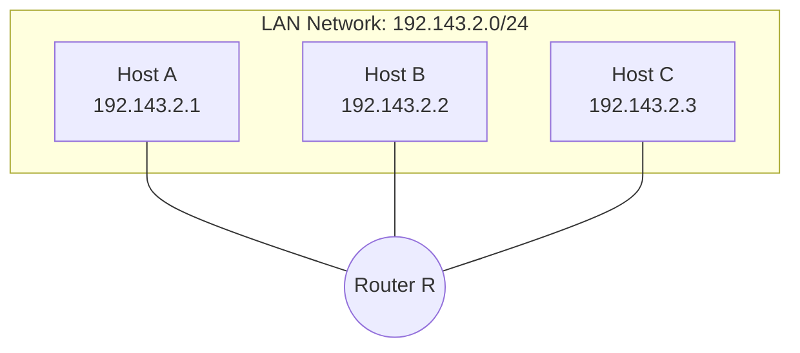

### ARP Request/Reply Flow (Host A ko Router R ka MAC chahiye):

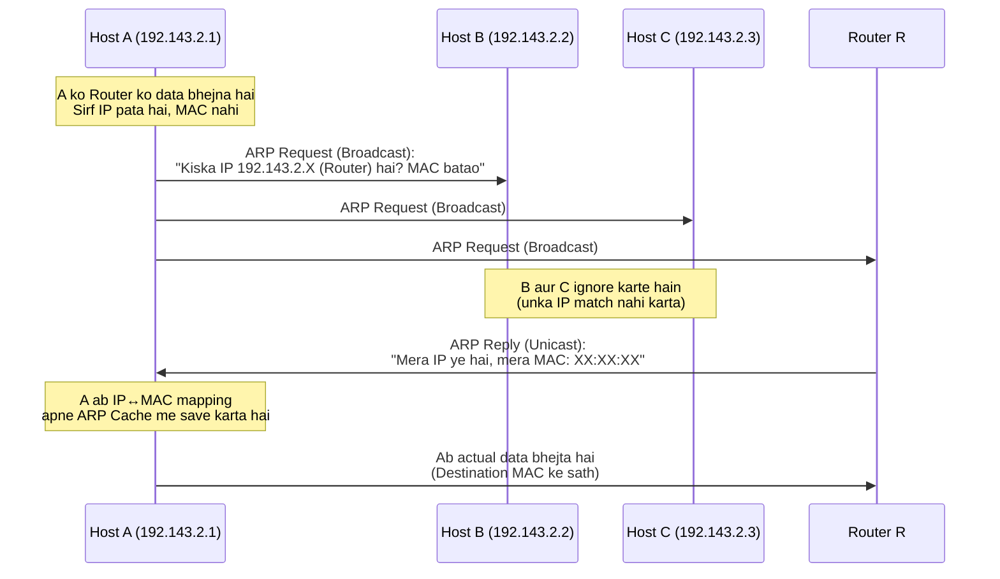

### Quick Points:

| Point               | Detail                                                                           |
| ------------------- | -------------------------------------------------------------------------------- |
| Full Form           | Address Resolution Protocol                                                      |
| Kaam                | IP Address → MAC Address resolve karna                                          |
| Request Type        | Broadcast (sabko jaati hai)                                                      |
| Reply Type          | Unicast (sirf jiska IP match kare, wahi reply karta hai)                         |
| Store kaha hota hai | ARP Cache / ARP Table (temporary, kuch time baad expire)                         |
| Layer               | Technically Layer 2 aur Layer 3 ke beech kaam karta hai                          |
| Kyun zaroori hai    | Kyunki Switch/Layer 2 delivery**sirf MAC address** se hoti hai, IP se nahi |

> 💡 **Packet Journey se connection:** Section 9 me jo tune padha tha ki "Router ka MAC address use hota hai locally" — wahi MAC address Host ko **ARP se hi milta hai**. Matlab har baar jab packet agle hop pe jata hai, ARP hi decide karta hai ki us hop ka MAC kya hai.

---

## 🔑 Quick Revision Table (Sabse Important — Ek Nazar Me)

| Concept                  | Kya Hai                                        | Yaad Rakhne Wali Line                         |
| ------------------------ | ---------------------------------------------- | --------------------------------------------- |
| **Network**        | Devices ka group jinka network part same hai   | Ek mohalla                                    |
| **Host**           | Ek single device                               | Ek ghar / ek member                           |
| **MAC Address**    | Physical identity, fixed                       | Aadhar card — kabhi nahi badalta             |
| **IP Address**     | Logical identity, changeable                   | Ghar ka address — badal sakta hai            |
| **Switch**         | Same LAN ke andar MAC se data bhejta hai       | MAC table maintain karta hai                  |
| **CIDR**           | Network aur Host ka split batata hai (`/24`) | Router ko raasta dikhata hai                  |
| **Subnet Mask**    | CIDR ka dusra format (`255.255.255.0`)       | 1s = Network, 0s = Host                       |
| **OSI Model**      | 7 layers ka theoretical blueprint              | Application → Physical                       |
| **TCP/IP Model**   | 4 layers ka practical/real-world model         | OSI ka simplified version                     |
| **Packet Journey** | Data source se destination tak kaise jata hai  | IP same rehta hai, MAC har hop pe badalta hai |
| **ARP**            | IP Address ko MAC Address me resolve karta hai | Request Broadcast, Reply Unicast              |

---

**Next revision me jo naya topic seekhega (Router deep-dive, DNS, DHCP, Ports, TCP 3-way handshake, etc.) wo isi file me next section me add karte jaana — flow yahi rakhna hai.** 🚀
