# 🔌 TCP Connection Termination (Four-Way Handshake)

> **Topic:** TCP Connection Termination
>
> **OSI Layer:** Transport Layer (Layer 4)
>
> **Protocol:** TCP (Transmission Control Protocol)
>
> **Process:** Four-Way Handshake

---

# 📖 What is TCP Connection Termination?

After data transfer is complete, the TCP connection should be closed properly.

Unlike connection establishment (Three-Way Handshake), closing a TCP connection requires **four separate steps**.

This process is called the **TCP Four-Way Handshake** or **TCP Connection Termination**.

It ensures:

- All remaining data is delivered.
- Both devices finish communication safely.
- Resources like memory and sockets are released.

---

# Why Do We Need Connection Termination?

Imagine you download a file.

After the download is complete:

- The browser no longer needs the connection.
- The server also no longer needs the connection.

Instead of leaving the connection open forever, TCP closes it gracefully.

Without proper termination:

- Memory would be wasted.
- Ports would remain occupied.
- Resources would never be released.

---

# Overall Process

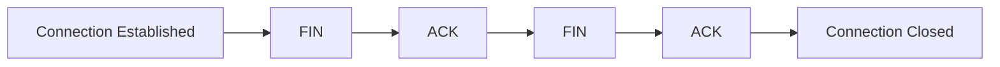

---

# Why Four Steps?

During communication,

- Client sends data.
- Server sends data.

These two directions are independent.

Each side must separately say:

> "I have finished sending data."

Therefore,

one FIN and one ACK are needed for each direction.

---

# Four-Way Handshake Overview

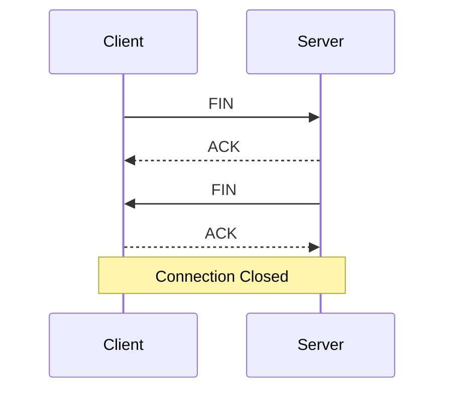

---

# Step 1 - Client Sends FIN

Suppose the client has finished sending data.

It sends a packet with the **FIN (Finish)** flag.

Meaning:

> "I have finished sending data."

Example

```text
Client

↓

FIN

↓

Server
```

---

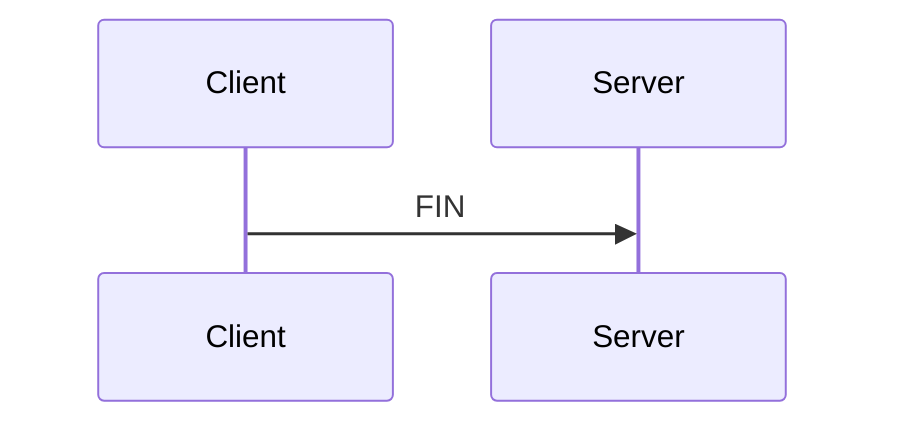

---

# Step 2 - Server Sends ACK

The server receives the FIN packet.

It replies with an ACK.

Meaning:

> "I received your FIN."

At this point,

the server **can still send data** if it has any remaining data.

The connection is now **Half-Closed**.

---

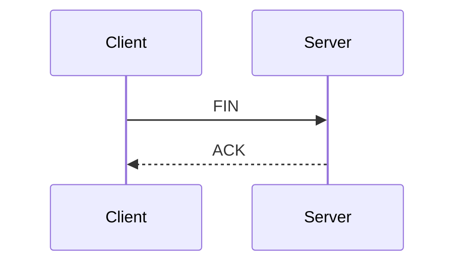

---

# What is a Half-Closed Connection?

After the server sends ACK,

```
Client → Server

Closed ❌
```

But

```
Server → Client

Still Open ✅
```

The server can continue sending any remaining data.

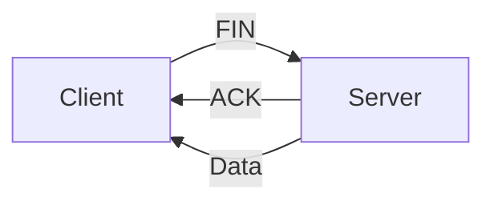

---

# Step 3 - Server Sends FIN

Once the server finishes sending all remaining data,

it sends its own FIN packet.

Meaning:

> "Now I have also finished sending data."

---

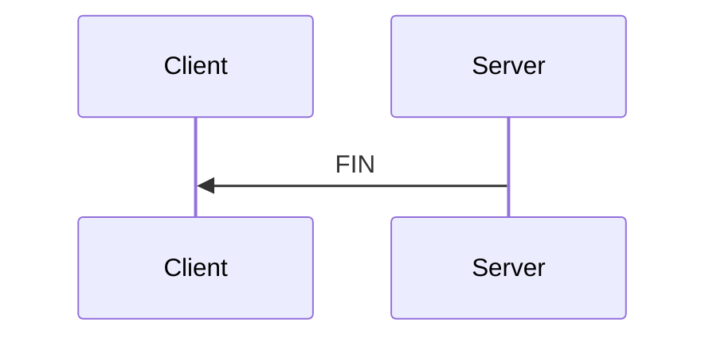

---

# Step 4 - Client Sends ACK

The client receives the server's FIN.

It sends one final ACK.

Meaning:

> "I received your FIN."

Now both sides know that communication has ended.

The TCP connection is closed.

---

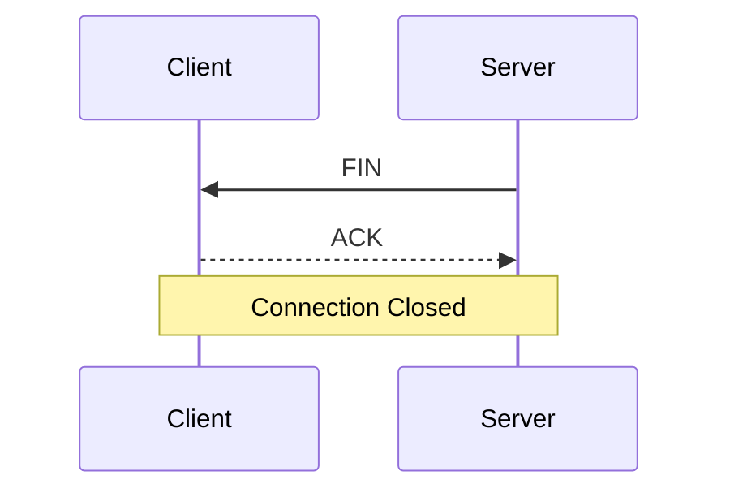

---

# Complete Four-Way Handshake

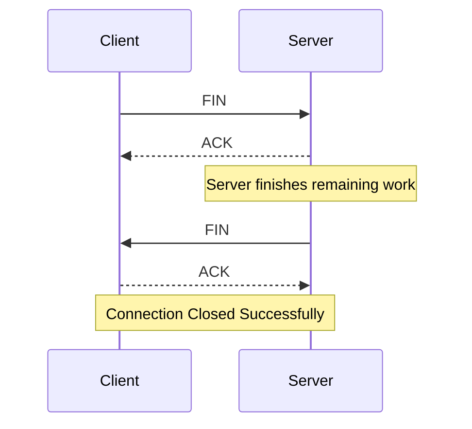

---

# Connection State Diagram

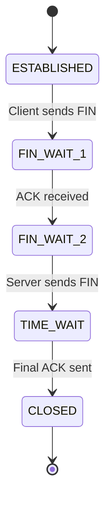

---

# Real-Life Example

Suppose you download a file from GitHub.

### Step 1

Your browser has received everything it needs.

Browser:

```
I am done receiving.

FIN
```

---

### Step 2

GitHub replies

```
ACK

I received your FIN.

Wait...
I'm finishing some work.
```

---

### Step 3

GitHub finishes sending logs and closes its side.

```
FIN
```

---

### Step 4

Browser replies

```
ACK

Connection Closed
```

---

# Visual Timeline

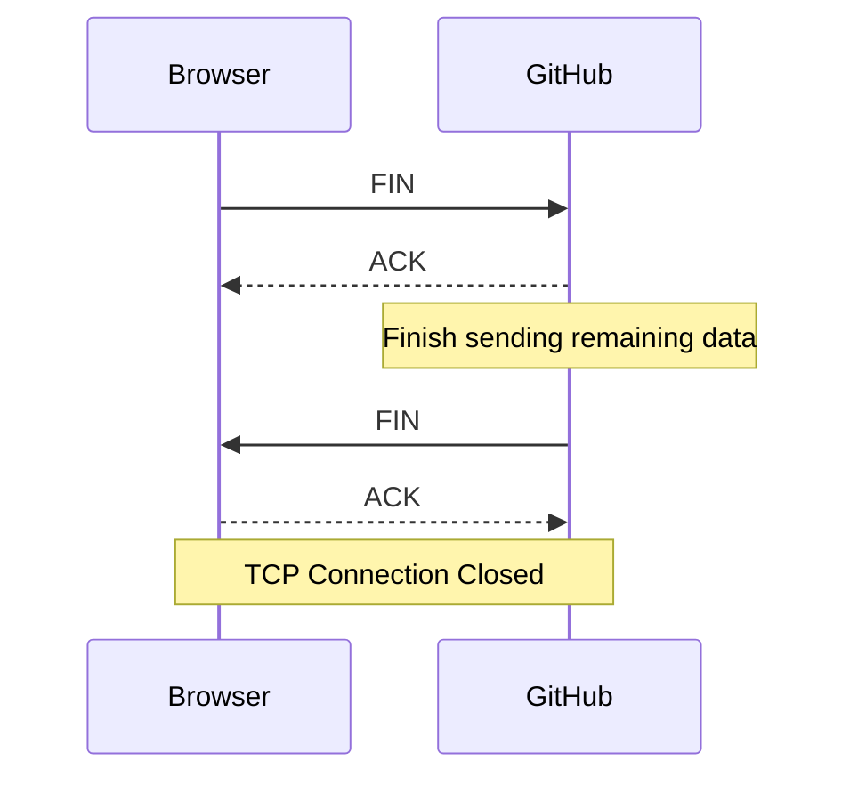

---

# Why Doesn't TCP Close Immediately?

Imagine

```
Client

↓

FIN
```

What if

the server still has data to send?

Closing immediately would lose that data.

Therefore,

TCP first acknowledges the FIN,

then sends remaining data,

and finally closes its side.

---

# What is TIME_WAIT?

After sending the last ACK,

the client does **not** immediately forget the connection.

Instead,

it enters a special state called **TIME_WAIT**.

Purpose:

- Ensure the final ACK reaches the server.
- Prevent delayed packets from interfering with future connections.

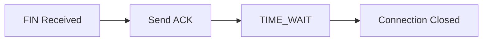

---

# TCP Connection Lifecycle

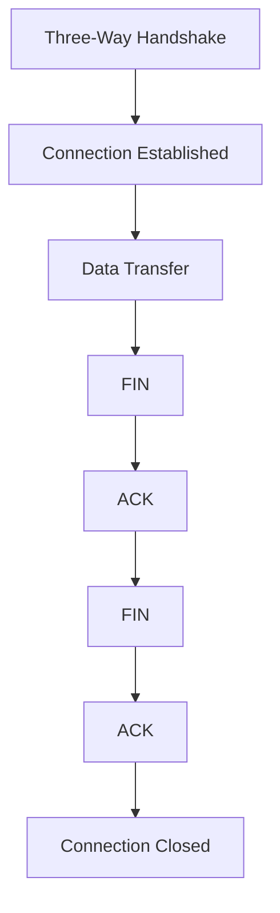

---

# Difference Between Handshake and Termination

| Feature           | Three-Way Handshake  | Four-Way Handshake |
| ----------------- | -------------------- | ------------------ |
| Purpose           | Establish Connection | Close Connection   |
| Number of Packets | 3                    | 4                  |
| Flags             | SYN, ACK             | FIN, ACK           |
| Connection State  | Starts               | Ends               |

---

# Advantages

✅ Gracefully closes the connection.

✅ Ensures all remaining data is delivered.

✅ Prevents data loss.

✅ Releases system resources.

---

# Disadvantages

❌ Requires more packets than UDP.

❌ Slightly increases connection closing time.

---

# Interview Questions

## What is TCP Connection Termination?

It is the process TCP uses to safely close a connection after all data has been transferred.

---

## Why does TCP use Four-Way Handshake?

Because each communication direction is independent.

Each side must separately indicate that it has finished sending data.

---

## Which flags are used?

- FIN
- ACK

---

## What is FIN?

FIN means **Finish**.

It tells the other side:

> "I have finished sending data."

---

## What is ACK?

ACK means **Acknowledgement**.

It confirms that the FIN packet has been received.

---

## What is a Half-Closed Connection?

A state where one side has stopped sending data, but the other side can still continue sending.

---

## What is TIME_WAIT?

TIME_WAIT is the state where TCP waits for a short time after sending the final ACK to ensure the connection closes safely.

---

## Does UDP have Connection Termination?

No.

UDP is connectionless and has no handshake or termination process.

---

# Summary

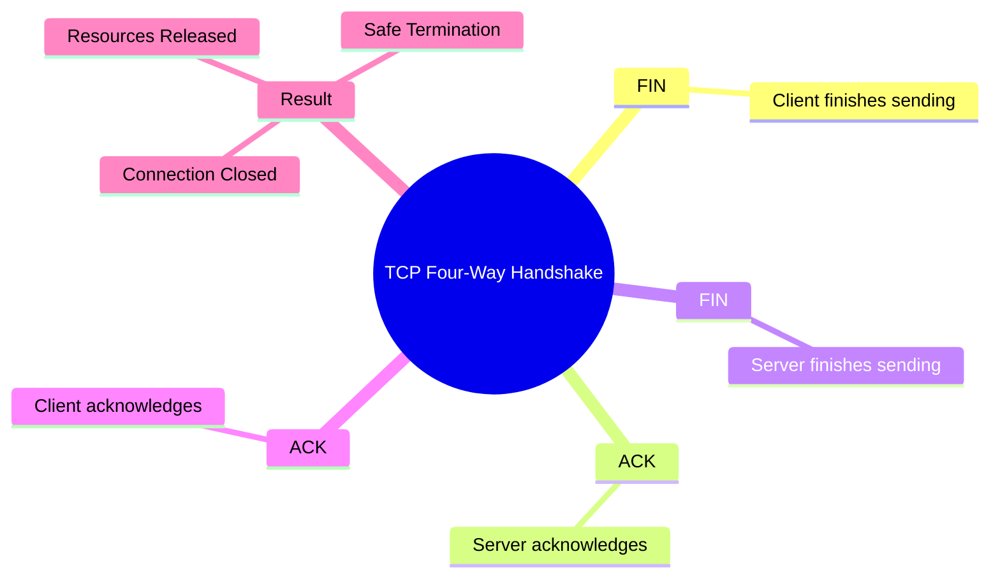

---

# Key Points

- TCP closes connections using a **Four-Way Handshake**.
- The process is **FIN → ACK → FIN → ACK**.
- Each side closes its communication independently.
- The connection becomes **Half-Closed** after the first ACK.
- The client enters the **TIME_WAIT** state before fully closing the connection.
- The Four-Way Handshake ensures **no data is lost** and all resources are released safely.
