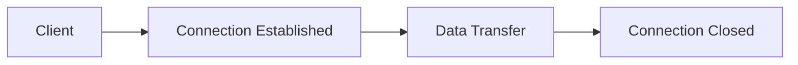
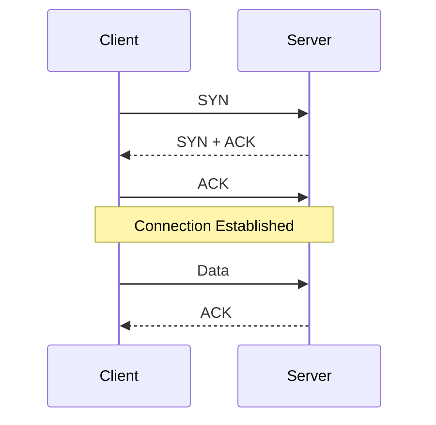
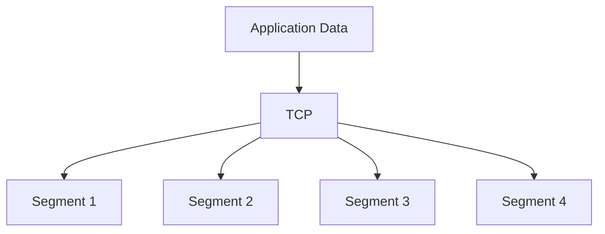
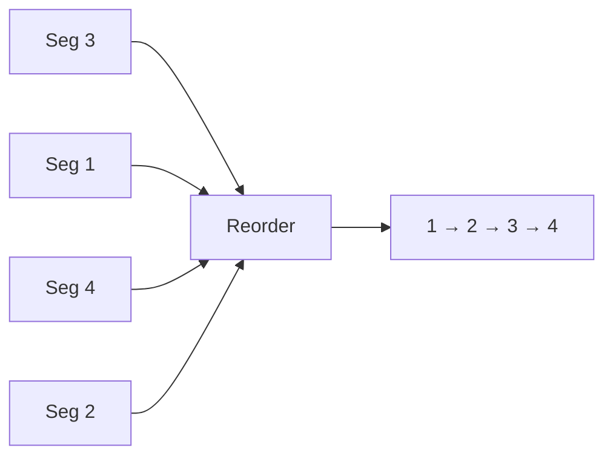
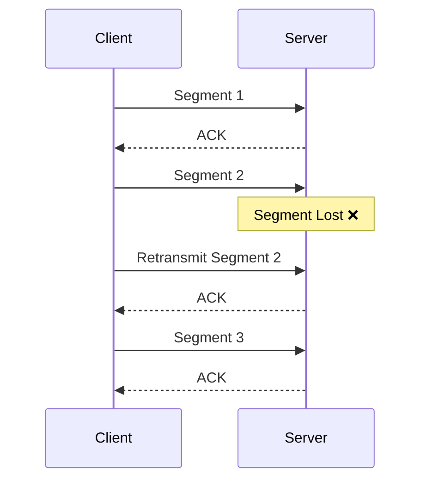
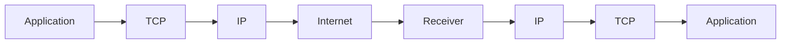
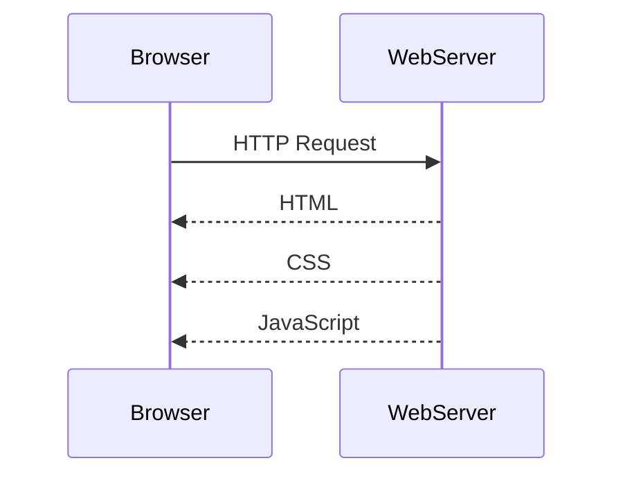
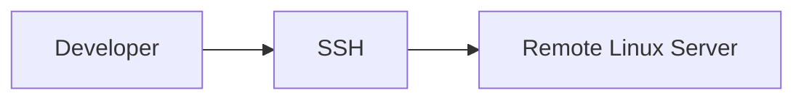

# 📡 Transmission Control Protocol (TCP)

> **Date Learned:** Day 17
>
> **OSI Layer:** Transport Layer (Layer 4)
>
> **Protocol Number:** 6
>
> **Connection Type:** Connection-Oriented
>
> **Reliable:** ✅ Yes
>
> **Ordered Delivery:** ✅ Yes

---

# 📖 What is TCP?

**TCP (Transmission Control Protocol)** is a transport layer protocol that provides **reliable communication** between two devices.

Unlike UDP, TCP first creates a connection before sending data.

TCP guarantees:

- Reliable delivery
- Ordered delivery
- Error checking
- Retransmission of lost packets
- Flow Control
- Congestion Control

---

# Stateful Protocol

TCP is a **Stateful Protocol**.

This means both the sender and receiver maintain information about the connection until communication is complete.

The connection has different states like:

- Connection Established
- Data Transfer
- Connection Closed



---

# Connection-Oriented Protocol

Before sending any data, TCP creates a connection.



This process is called the **Three-Way Handshake**.

---

# How TCP Sends Data

Suppose the application wants to send a large file.

TCP divides the file into small pieces called **Segments**.

```
Original Data

↓

TCP

↓

Segment 1

Segment 2

Segment 3

Segment 4
```



---

# What is a TCP Segment?

A **TCP Segment** is the basic unit of data sent by TCP.

Each segment contains

- TCP Header
- Payload (Data)

```
+-------------------+
| TCP Header        |
+-------------------+
| Payload (Data)    |
+-------------------+
```

---

# Ordered Delivery

TCP keeps every segment in the correct order.

Example

Sender sends

```
Segment 1

Segment 2

Segment 3

Segment 4
```

Suppose they arrive like this

```
Segment 3

Segment 1

Segment 4

Segment 2
```

TCP rearranges them before giving them to the application.



The application always receives data in the correct order.

---

# Reliable Communication

TCP guarantees reliable delivery.

If one segment is lost,

TCP automatically sends it again.



---

# Why TCP is Reliable

TCP provides

- Sequence Numbers
- Acknowledgements (ACK)
- Retransmission
- Error Detection
- Flow Control
- Congestion Control

Because of these features,

TCP is slower than UDP but much more reliable.

---

# TCP Communication Flow



---

# TCP vs UDP

| Feature          | TCP          | UDP     |
| ---------------- | ------------ | ------- |
| Connection       | ✅ Yes       | ❌ No   |
| Reliable         | ✅ Yes       | ❌ No   |
| Ordered Delivery | ✅ Yes       | ❌ No   |
| ACK              | ✅ Yes       | ❌ No   |
| Retransmission   | ✅ Yes       | ❌ No   |
| Speed            | Slower       | Faster  |
| Header Size      | 20–60 Bytes | 8 Bytes |

---

# Common Use Cases of TCP

## 🗄️ Database Connections

Databases require every query and response to arrive correctly.

Examples

- MySQL
- PostgreSQL
- SQL Server
- MongoDB

Missing even one packet could corrupt the query or response.

---

## 🌐 HTTP / HTTPS

Websites use TCP to transfer

- HTML
- CSS
- JavaScript
- Images
- Videos

The browser must receive every byte correctly.



---

## 📂 FTP (File Transfer Protocol)

FTP is used to transfer files.

TCP ensures the complete file arrives without corruption.

Examples

- Uploading files
- Downloading files

---

## 📧 Email

Email protocols use TCP because every email must arrive completely.

Examples

- SMTP (Sending Emails)
- POP3 (Receiving Emails)
- IMAP (Synchronizing Emails)

---

## 🔐 SSH (Secure Shell)

SSH is used for secure remote access to another computer.

Example

```
ssh user@server-ip
```

Uses

- Remote Server Login
- Linux Administration
- Secure Command Execution



---

# Advantages of TCP

✅ Reliable communication

✅ Ordered delivery

✅ Automatic retransmission

✅ Error detection

✅ Flow control

✅ Congestion control

---

# Disadvantages of TCP

❌ Slower than UDP

❌ More overhead

❌ Requires connection establishment

❌ Larger header size

---

# Interview Questions

## What is TCP?

TCP (Transmission Control Protocol) is a reliable, connection-oriented transport layer protocol that guarantees data delivery.

---

## Why is TCP called Stateful?

Because it maintains the connection state throughout communication until the connection is closed.

---

## What is a TCP Segment?

A TCP Segment is the unit of data sent by TCP. It consists of a TCP Header and Payload.

---

## Why does TCP divide data into segments?

Large data cannot be sent all at once. TCP breaks it into smaller segments for efficient and reliable transmission.

---

## What happens if one TCP segment is lost?

TCP detects the missing segment and retransmits it automatically.

---

## Which applications use TCP?

- HTTP / HTTPS
- Database Connections
- FTP
- SMTP
- POP3
- IMAP
- SSH

---

# Summary

- TCP stands for **Transmission Control Protocol**.
- It is a **Transport Layer** protocol.
- TCP is **Stateful** and **Connection-Oriented**.
- Data is divided into **Segments**.
- TCP guarantees **reliable and ordered delivery**.
- Lost segments are automatically retransmitted.
- TCP is widely used in web browsing, databases, file transfer, email, and remote server access.
