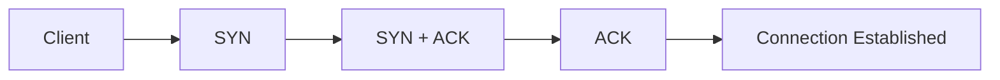
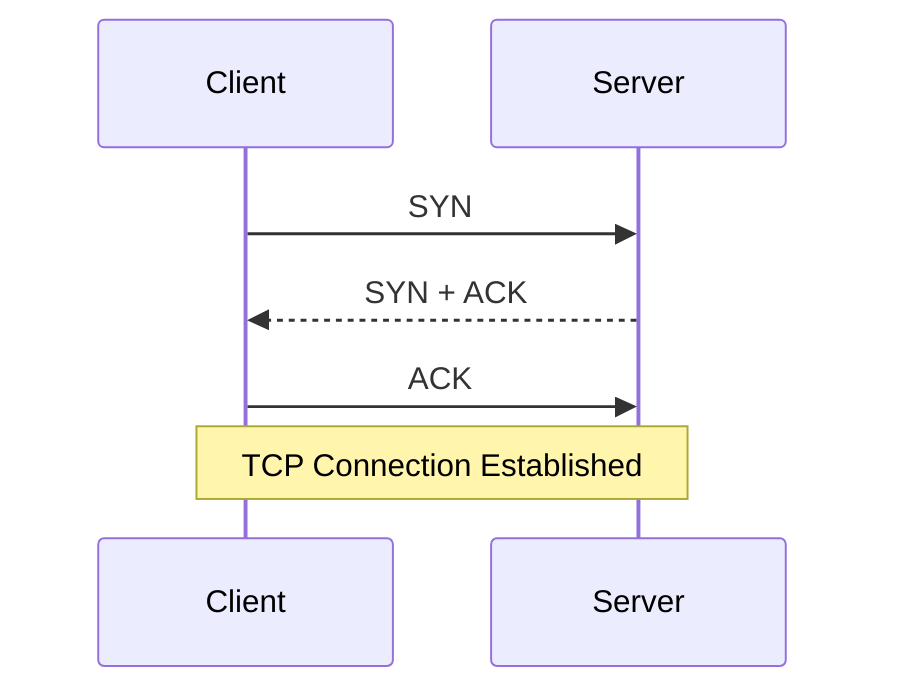
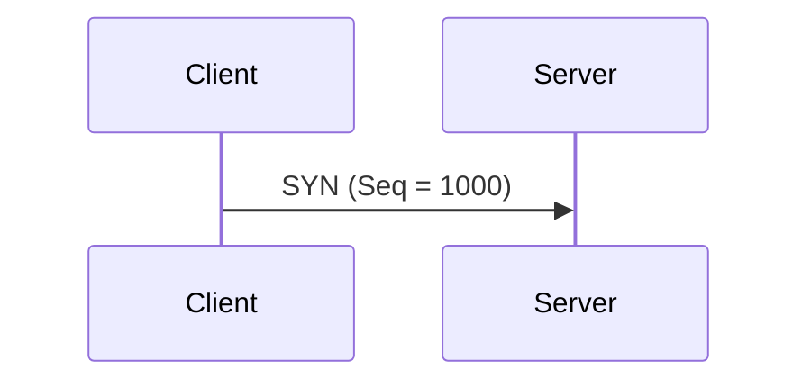
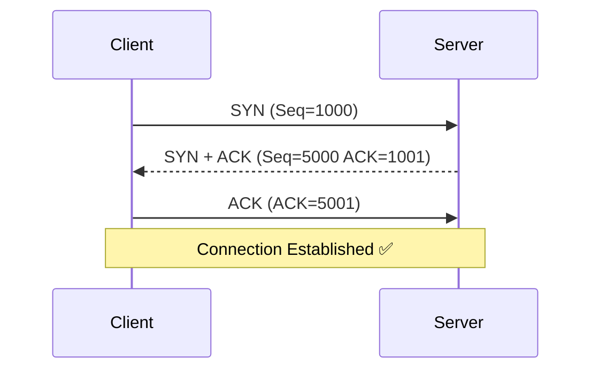
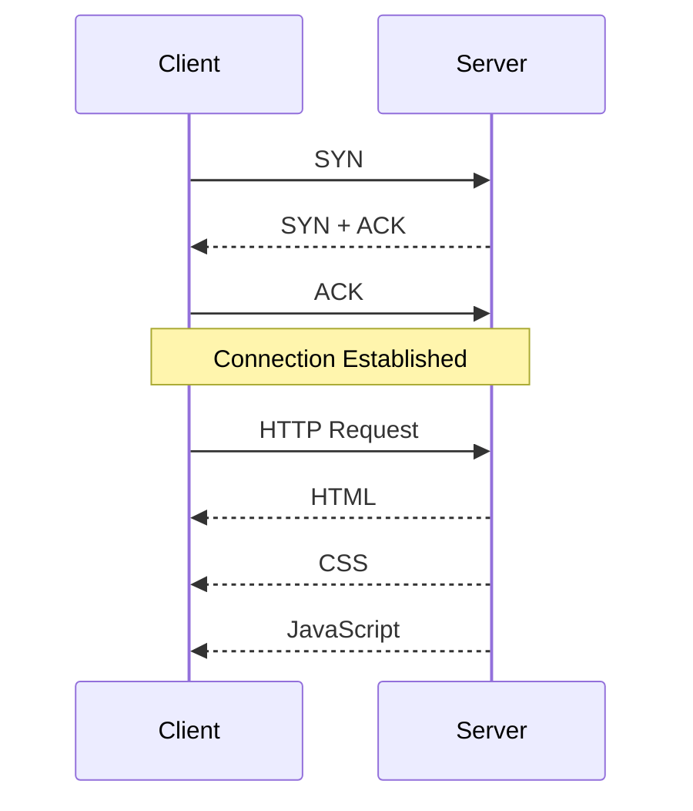
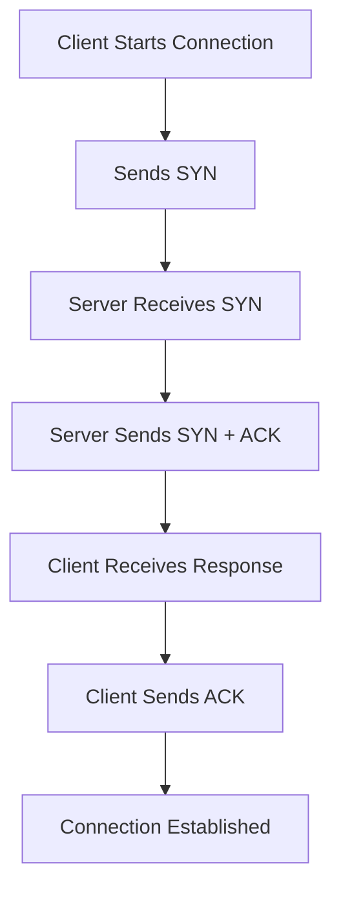
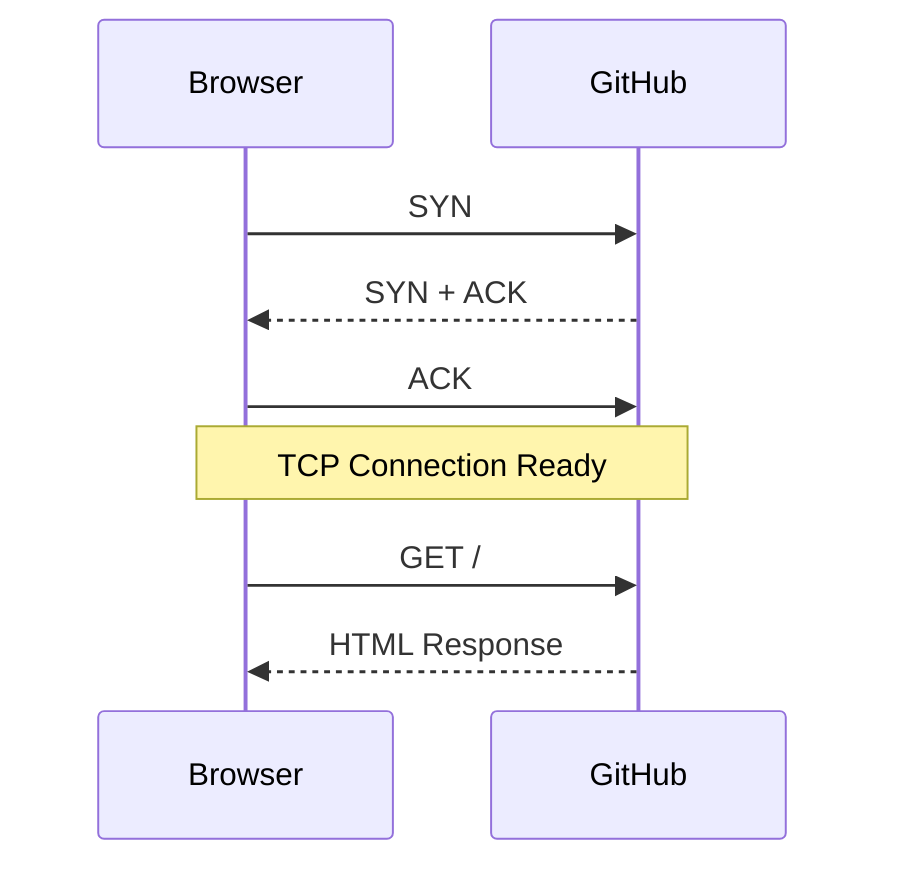
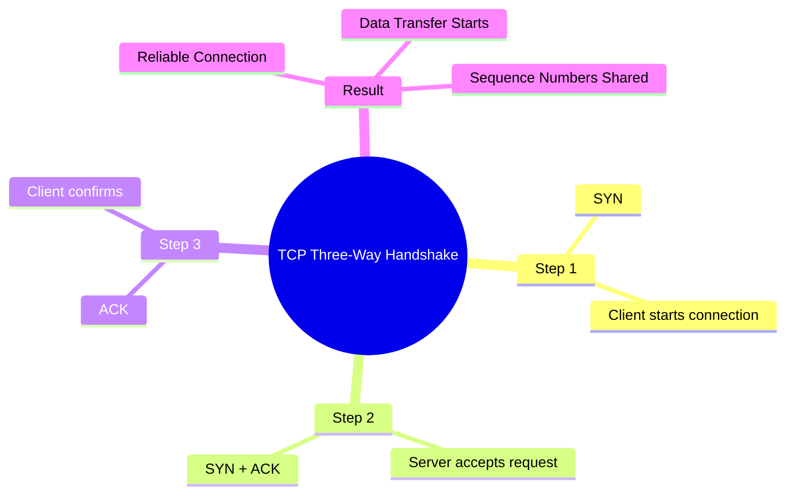

# 🤝 TCP Three-Way Handshake

> **Topic:** TCP Connection Establishment
>
> **OSI Layer:** Transport Layer (Layer 4)
>
> **Protocol:** TCP (Transmission Control Protocol)

---

# 📖 What is the Three-Way Handshake?

Before TCP sends any actual data, it must first establish a reliable connection between the **client** and the **server**.

This connection establishment process is called the **TCP Three-Way Handshake**.

It consists of **three steps**:

1. SYN
2. SYN + ACK
3. ACK

After these three steps, both devices are ready to exchange data.

---

# Why Do We Need the Three-Way Handshake?

TCP is a **connection-oriented protocol**.

Before sending data, both the client and server must agree that:

- Both devices are online.
- Both devices are ready to communicate.
- Initial sequence numbers are exchanged.
- A reliable connection is established.

Without the handshake, the sender would not know if the receiver was ready.

---

# Overall Flow



---

# Three-Way Handshake Overview



---

# Step 1 - SYN

The client wants to connect to the server.

It sends a packet with the **SYN (Synchronize)** flag.

Example:

```
Client

↓

SYN

↓

Server
```

The SYN packet contains an **Initial Sequence Number (ISN)**.

Example

```
Sequence Number = 1000
```

Meaning

> "I want to start communication."

---



---

# Step 2 - SYN + ACK

The server receives the SYN packet.

The server replies with

- SYN
- ACK

The ACK confirms that it received the client's SYN.

The server also sends its own sequence number.

Example

```
Server

↓

SYN + ACK

↓

Client
```

Example Values

```
ACK = 1001

Seq = 5000
```

Meaning

```
I received your request.

Now here is my sequence number.
```

---

```mermaid
sequenceDiagram

participant Client
participant Server

Client->>Server: SYN (Seq=1000)

Server-->>Client: SYN + ACK

Note right of Server
Seq = 5000

ACK = 1001
end note
```

---

# Step 3 - ACK

Now the client receives the server's response.

The client sends one final ACK.

```
ACK = 5001
```

Meaning

```
I received your sequence number.

Now we can communicate.
```

---

```mermaid
sequenceDiagram

participant Client
participant Server

Client->>Server: ACK

Note left of Client

ACK = 5001

end note
```

---

# Complete Three-Way Handshake



---

# After the Handshake

Once the connection is established, actual application data is transferred.



---

# Understanding Sequence Number

Every byte sent by TCP has a sequence number.

Example

```
Hello
```

```
H -> 1000

e -> 1001

l -> 1002

l -> 1003

o -> 1004
```

Sequence numbers help TCP

- Detect lost packets
- Maintain order
- Retransmit missing data

---

# Understanding ACK Number

ACK means

> "I successfully received your data."

Example

```
Received

1000

1001

1002

1003
```

The receiver replies

```
ACK = 1004
```

Meaning

```
I have received everything until 1003.

Please send byte 1004 next.
```

---

# Handshake Timeline



---

# Real World Example

Suppose you open

```
https://github.com
```

Your browser first performs

```
TCP Three-Way Handshake
```

Only after the connection is established does the browser send

```
HTTP Request
```



---

# Why Only Three Steps?

Three packets are enough to verify that

- Client is alive.
- Server is alive.
- Both sides know each other's sequence numbers.
- Both sides are ready to exchange data.

---

# Why Not Two Steps?

Suppose only

```
SYN

↓

ACK
```

The server would not know whether the client actually received its response.

The final ACK confirms that the client received the server's packet.

---

# Applications That Use TCP Handshake

Before communication starts, these protocols perform a TCP handshake.

- HTTP
- HTTPS
- FTP
- SMTP
- POP3
- IMAP
- SSH
- MySQL
- PostgreSQL
- MongoDB

---

# Advantages

✅ Reliable communication

✅ Confirms both devices are ready

✅ Exchanges sequence numbers

✅ Detects unreachable hosts

✅ Prevents half-open communication

---

# Disadvantages

❌ Adds one network round trip before data transfer

❌ Slightly slower than UDP

❌ More overhead

---

# Interview Questions

## What is a TCP Three-Way Handshake?

It is the process TCP uses to establish a reliable connection before sending data.

---

## What are the three steps?

1. SYN
2. SYN + ACK
3. ACK

---

## What does SYN mean?

Synchronize.

It is used to start a new TCP connection and exchange sequence numbers.

---

## What does ACK mean?

Acknowledgement.

It confirms that data has been received successfully.

---

## Why is the Three-Way Handshake required?

To ensure that both the client and server are ready to communicate and to exchange their initial sequence numbers.

---

## Does UDP use a Three-Way Handshake?

No.

UDP is connectionless and sends data immediately.

---

# Summary



---

# Key Points

- TCP is a **connection-oriented** protocol.
- Before sending data, TCP performs a **Three-Way Handshake**.
- The handshake consists of **SYN → SYN + ACK → ACK**.
- The handshake exchanges **Initial Sequence Numbers (ISNs)**.
- After the handshake, the client and server can exchange data reliably.
- Protocols such as **HTTP, HTTPS, FTP, SSH, SMTP, and database connections** rely on this process.
