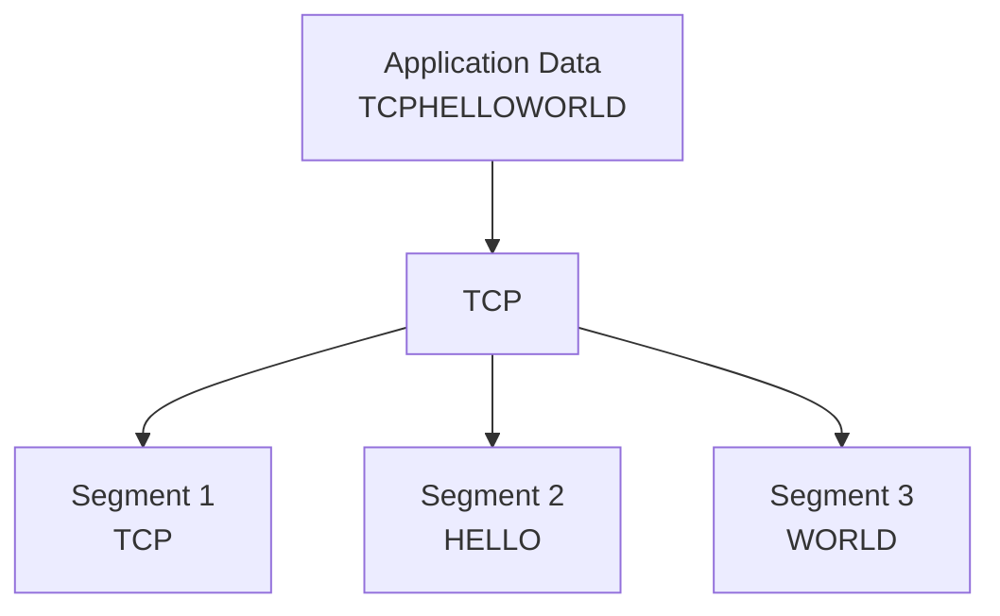
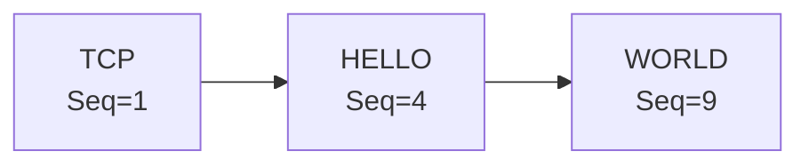
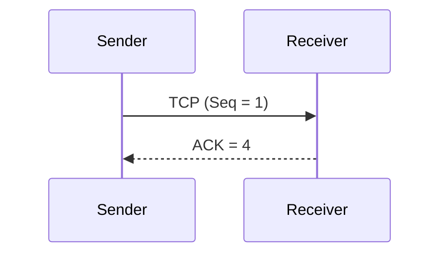
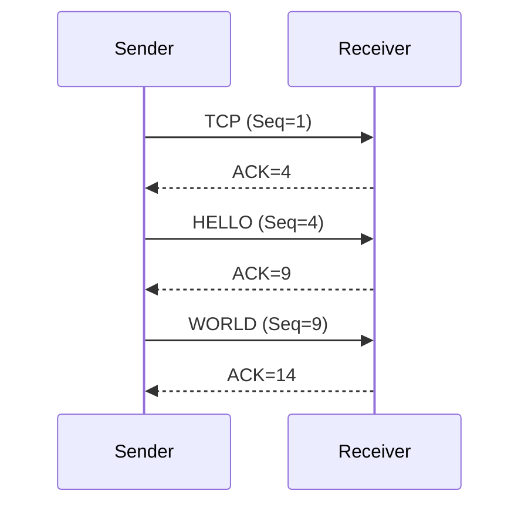
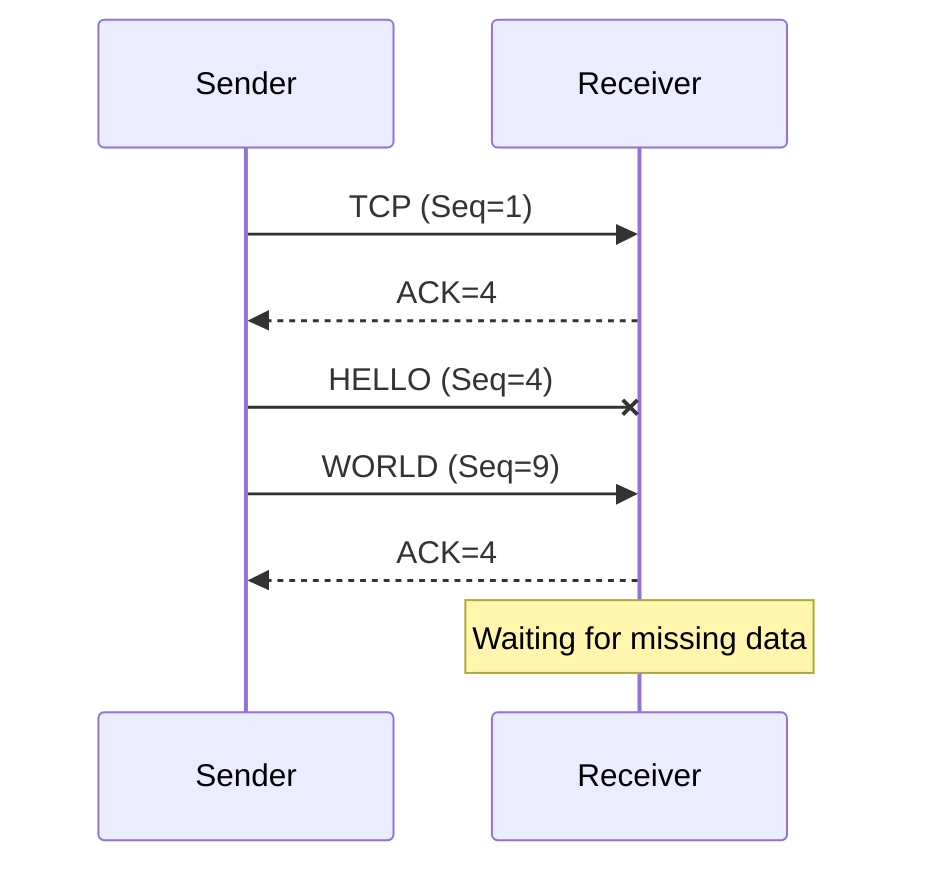
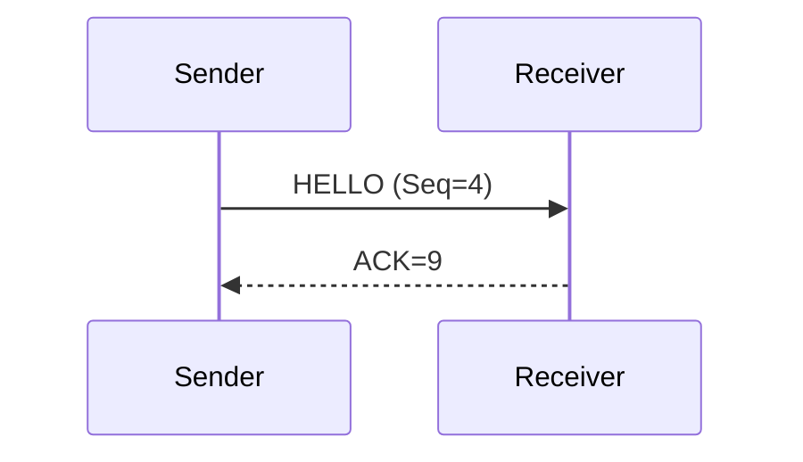
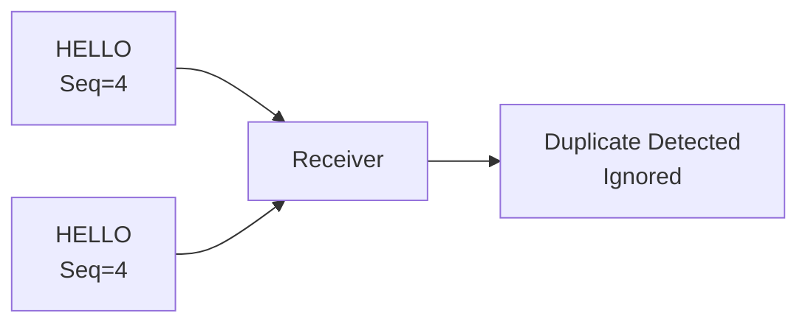
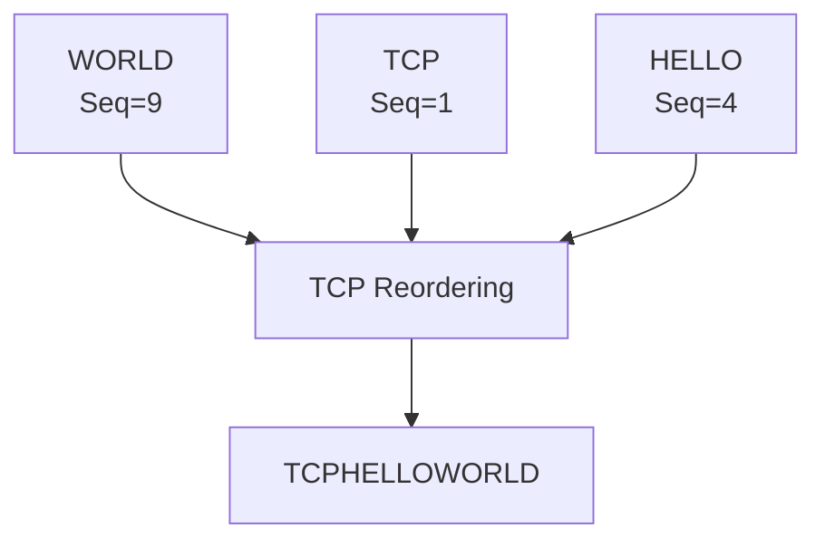
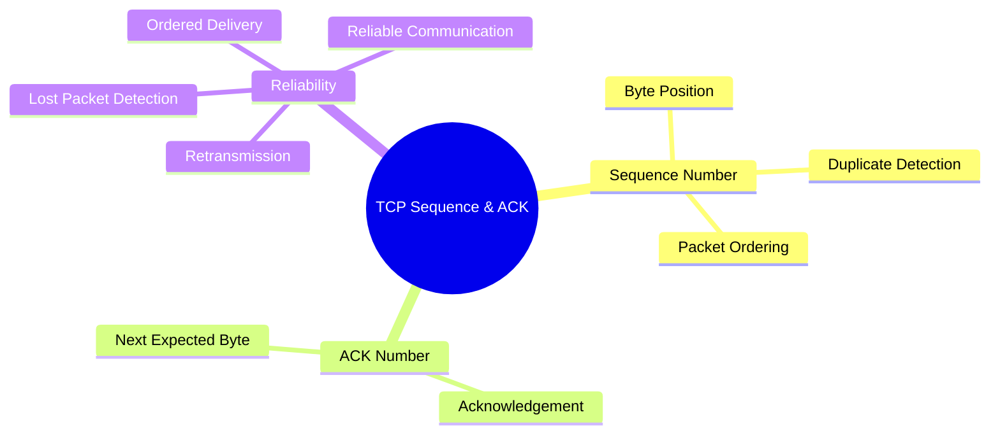

# 🔢 TCP Sequence Number & Acknowledgement Number

> **Topic:** TCP Sequence Number and ACK Number
>
> **OSI Layer:** Transport Layer (Layer 4)
>
> **Protocol:** TCP (Transmission Control Protocol)

---

# 📖 Introduction

TCP is a **reliable transport layer protocol**.

To provide reliability, TCP uses two important fields:

- **Sequence Number (Seq)**
- **Acknowledgement Number (ACK)**

Together, these fields help TCP:

- Detect lost segments
- Detect duplicate segments
- Retransmit missing data
- Deliver data in the correct order

---

# Why Does TCP Need Sequence Numbers?

Imagine you want to send a long message.

```
TCPHELLOWORLD
```

Instead of sending everything in one packet,

TCP divides the data into multiple **segments**.

```
TCP

HELLO

WORLD
```

Each segment gets its own **Sequence Number**.

---

# Data Segmentation



---

# What is a Sequence Number?

A **Sequence Number** tells the receiver

> **Where this segment belongs in the complete data stream.**

It represents the position of the **first byte** inside a TCP segment.

Think of it like page numbers in a book.

Without page numbers,

you would never know the correct order.

---

# Example

Suppose we send

```
TCPHELLOWORLD
```

Total characters

```
13 Bytes
```

---

## Segment 1

```
TCP
```

```
3 Bytes
```

Byte positions

```
1
2
3
```

Sequence Number

```
1
```

---

## Segment 2

```
HELLO
```

```
5 Bytes
```

Byte positions

```
4
5
6
7
8
```

Sequence Number

```
4
```

---

## Segment 3

```
WORLD
```

```
5 Bytes
```

Byte positions

```
9
10
11
12
13
```

Sequence Number

```
9
```

---

# Visual Representation

```text
Application Data

TCPHELLOWORLD

↓

Segment 1

TCP

Seq = 1

↓

Segment 2

HELLO

Seq = 4

↓

Segment 3

WORLD

Seq = 9
```

---

# Segment Diagram



---

# What is an ACK Number?

ACK stands for

**Acknowledgement**

It tells the sender

> **I have received everything up to this byte.**

The ACK Number always contains

> **The next byte the receiver expects.**

---

# Example

Sender sends

```
TCP

Bytes

1

2

3
```

Receiver receives it successfully.

Receiver replies

```
ACK = 4
```

Meaning

```
I have received

1

2

3

Please send

4
```

---

# ACK Flow



---

# Sending Multiple Segments

Suppose the sender sends

```
Segment 1

TCP

Seq = 1
```

Receiver replies

```
ACK = 4
```

Next

```
HELLO

Seq = 4
```

Receiver replies

```
ACK = 9
```

Next

```
WORLD

Seq = 9
```

Receiver replies

```
ACK = 14
```

---

# Complete Communication



---

# Why ACK = 14?

```
TCP

HELLO

WORLD
```

Bytes

```
1

2

3

4

5

6

7

8

9

10

11

12

13
```

The next expected byte is

```
14
```

So

```
ACK = 14
```

---

# Lost Segment Example

Suppose

```
TCP

↓

HELLO

↓

WORLD
```

But

```
HELLO
```

gets lost.

---



The receiver **does not** acknowledge `WORLD` because it is still waiting for `HELLO`.

---

# Retransmission

When the sender receives repeated

```
ACK = 4
```

it understands

```
Segment starting at byte 4 is missing.
```

The sender retransmits it.



Now communication continues normally.

---

# Duplicate Segment Detection

Suppose the sender accidentally sends

```
HELLO
```

twice.



Because both segments have the same Sequence Number,

TCP knows the second one is a duplicate.

---

# Ordered Delivery

Suppose packets arrive in this order

```
WORLD

TCP

HELLO
```

The receiver stores them.

Using Sequence Numbers,

TCP rearranges them.

```
TCP

HELLO

WORLD
```

---



---

# Together, Sequence Number and ACK Number

Both fields work together to make TCP reliable.

| Feature                  | Sequence Number | ACK Number |
| ------------------------ | --------------- | ---------- |
| Identifies data position | ✅              | ❌         |
| Confirms received data   | ❌              | ✅         |
| Detects lost packets     | ✅              | ✅         |
| Supports retransmission  | ✅              | ✅         |
| Maintains correct order  | ✅              | ❌         |

---

# Real World Example

Suppose you download a file.

```
movie.mp4
```

The file is divided into thousands of TCP segments.

Each segment has

```
Sequence Number
```

After receiving each segment,

your computer sends

```
ACK
```

If one segment is lost,

the server retransmits only the missing segment.

This makes downloading reliable.

---

# Applications Using Sequence and ACK Numbers

Every TCP-based protocol uses these fields.

- HTTP
- HTTPS
- FTP
- SSH
- SMTP
- IMAP
- POP3
- MySQL
- PostgreSQL
- MongoDB

---

# Advantages

✅ Reliable communication

✅ Ordered delivery

✅ Lost packet detection

✅ Duplicate packet detection

✅ Automatic retransmission

---

# Interview Questions

## What is a Sequence Number?

A Sequence Number identifies the position of the first byte in a TCP segment.

---

## What is an ACK Number?

An ACK Number tells the sender the next byte the receiver expects.

---

## Why does TCP use Sequence Numbers?

To maintain order, detect lost packets, and identify duplicate packets.

---

## Why does TCP use ACK Numbers?

To confirm successful delivery of data and request the next expected byte.

---

## What happens if a segment is lost?

The receiver keeps acknowledging the last successfully received byte.

The sender detects the missing segment and retransmits it.

---

## Can TCP detect duplicate packets?

Yes.

Duplicate packets have the same Sequence Number, so TCP ignores the duplicates.

---

# Summary



---

# Key Points

- TCP divides large data into **segments**.
- Every segment starts with a **Sequence Number**, which represents the position of its first byte.
- The receiver replies with an **ACK Number**, indicating the next byte it expects.
- Sequence Numbers help detect **lost** and **duplicate** segments.
- ACK Numbers confirm successful delivery and trigger **retransmission** when data is missing.
- Together, **Sequence Number** and **ACK Number** make TCP reliable and ensure data is delivered in the correct order.
