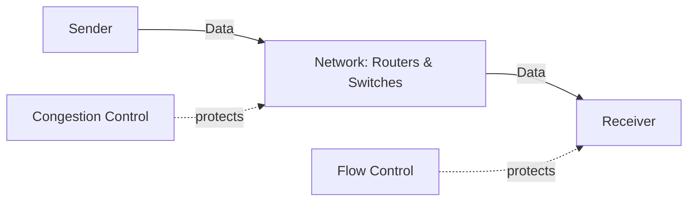
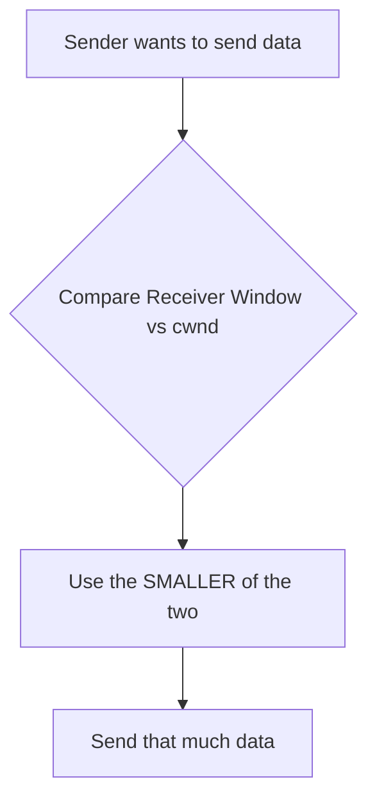
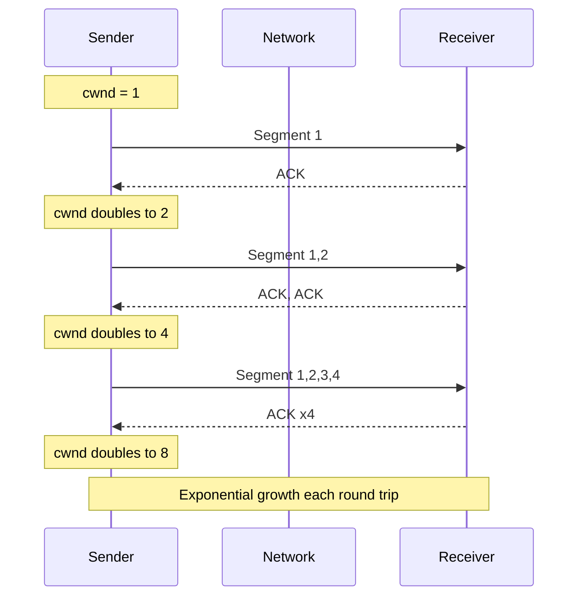
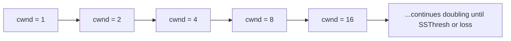
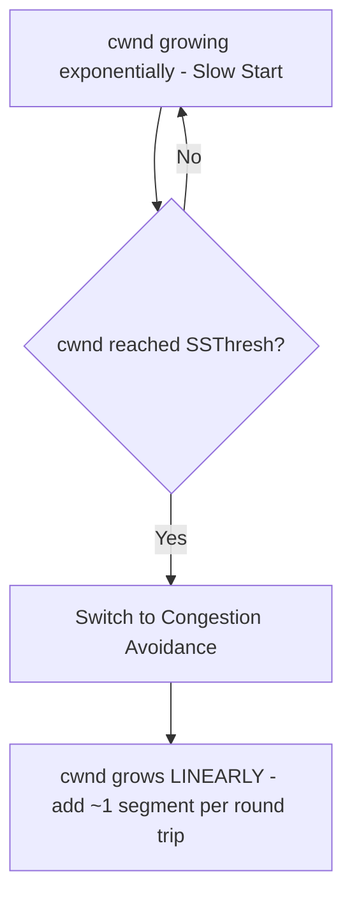
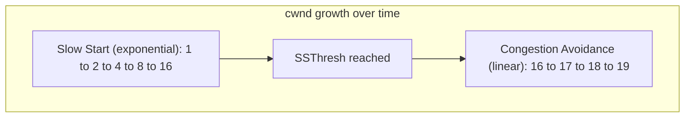
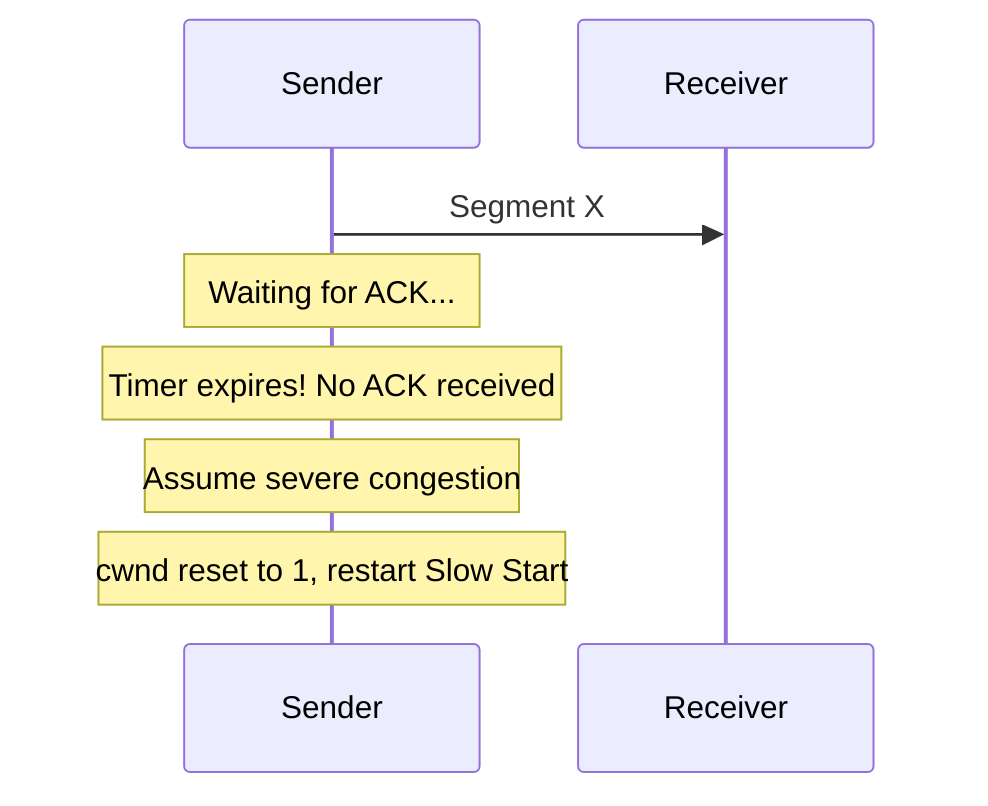
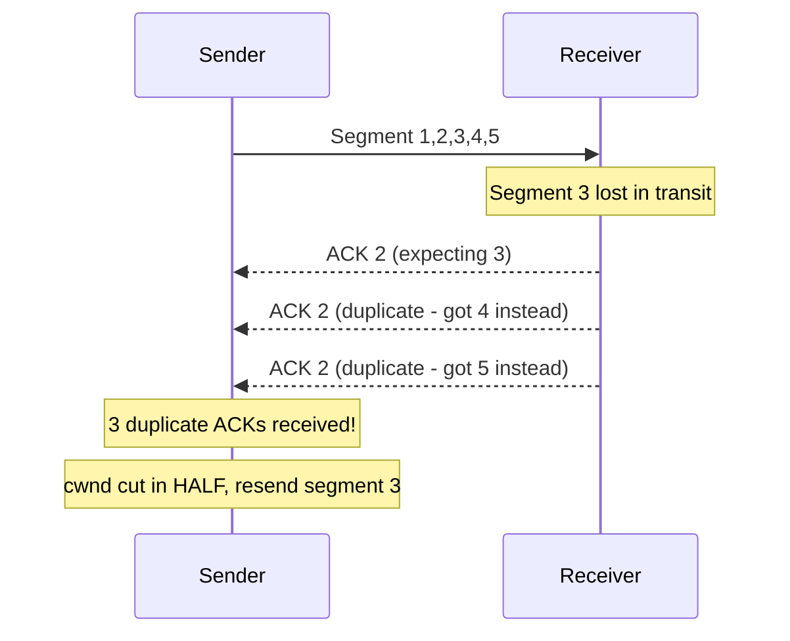
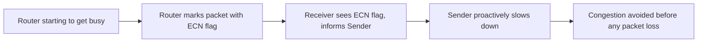
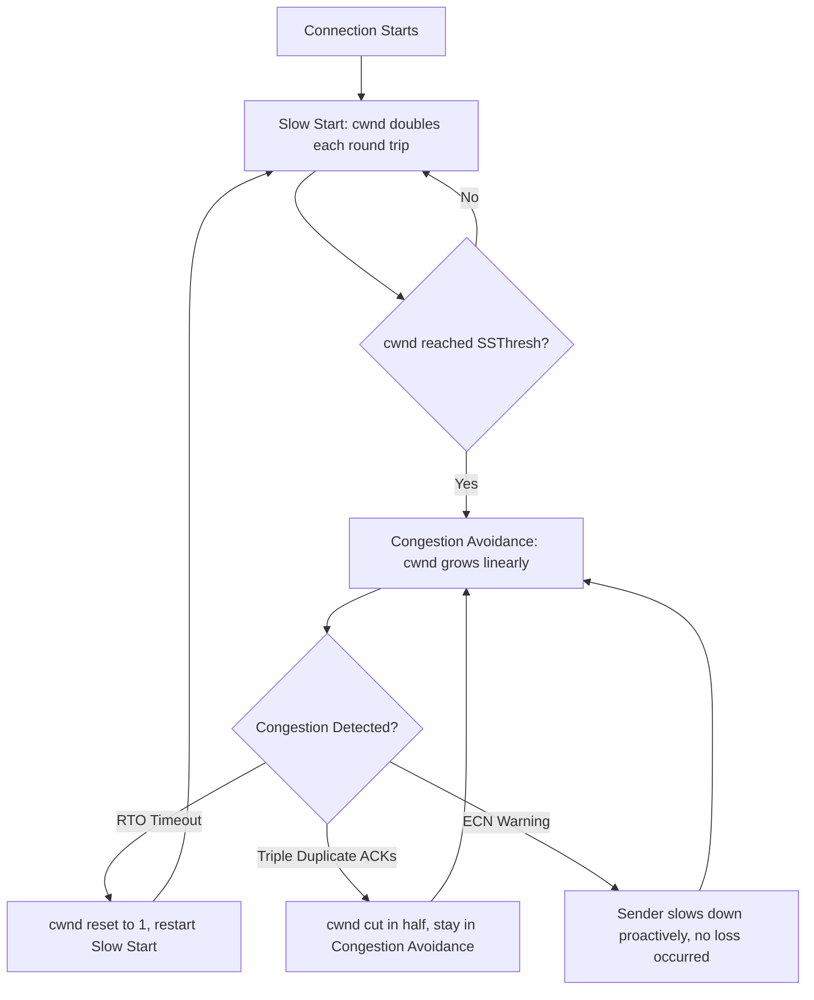

# TCP Congestion Control: Slow Start, Avoidance & Loss Detection

Simple notes on how TCP protects the **network** (routers/switches) from getting overloaded — different from flow control, which protects the **receiver**.

---

## Flow Control vs Congestion Control (Don't Mix Them Up)

**Simple meaning:**
- **Flow Control** = protects the **receiver** so its buffer doesn't overflow
- **Congestion Control** = protects the **network** (routers/switches in between) so it doesn't get overloaded

**Key Point:** A receiver can have a huge buffer (no flow control problem) but the network in between could still be congested. That's why TCP needs both mechanisms separately.

---

## 1. Congestion Window (cwnd)

**Simple meaning:** The **congestion window (cwnd)** is like the Window Size, but instead of being *told* by the receiver, the sender has to **figure it out on its own** through trial and error — since routers don't explicitly report their capacity.

**Key Points:**
- Receiver Window = told directly by receiver
- Congestion Window (cwnd) = sender estimates it by testing the network
- Sender starts small, sends data, watches what happens (success or loss), and adjusts
- The **actual amount of data sent** = whichever is smaller: Receiver Window or cwnd

---

## 2. TCP Slow Start

**Simple meaning:** TCP doesn't know the network's capacity at the start, so it begins **cautiously with a small window**, then **doubles it every round trip** (every time it gets ACKs back) — this is an exponential growth pattern, allowing a fast ramp-up without immediately flooding the network.

**How it works:**
1. Start with a small cwnd (e.g., 1 segment)
2. Send that many segments, wait for ACKs
3. For every round trip with successful ACKs, **double** the cwnd
4. Keep doubling until it hits a limit called **SSThresh (Slow Start Threshold)** or until loss is detected

**Key Points:**
- Starts small and cautious
- Doubles every round trip (exponential growth)
- Fast way to discover available bandwidth
- Continues until SSThresh is reached or a loss happens

---

## 3. Congestion Avoidance

**Simple meaning:** Once cwnd reaches the **Slow Start Threshold (SSThresh)**, TCP realizes it's getting close to the network's limit. Doubling further would be risky, so it switches from **exponential growth** to a much slower, safer **linear growth** (adding roughly one segment per round trip instead of doubling).

**Key Points:**
- Triggered once cwnd reaches SSThresh
- Growth changes from exponential (doubling) to linear (adding a little at a time)
- Goal: probe for more bandwidth carefully without causing congestion
- More conservative, avoids overshooting network capacity

---

## Congestion Detection: How TCP Notices a Problem

There are three ways TCP detects that the network is congested, each triggering a different reaction.

### A. Retransmission Timeout (RTO) — Severe Congestion

**Simple meaning:** If an ACK doesn't arrive before a timer runs out, TCP assumes something went seriously wrong (segment likely lost due to heavy congestion). This is treated as the **worst case**, so TCP reacts drastically:
- cwnd is **reset all the way down to 1**
- Slow Start begins again from scratch

**Key Points:**
- Trigger: No ACK received within the timeout window
- Assumption: Severe congestion or major packet loss
- Reaction: cwnd drops to 1, restart Slow Start

### B. Triple Duplicate ACKs — Moderate Congestion

**Simple meaning:** If the receiver keeps sending the **same ACK number three times** (duplicate ACKs), it means one segment likely got lost, but later segments are still arriving fine. This is a **less severe** signal than a timeout, so TCP reacts more gently:
- cwnd is **cut in half**, not reset to 1
- No need to restart Slow Start completely

**Key Points:**
- Trigger: 3 duplicate ACKs for the same segment
- Assumption: A single segment lost, but network isn't collapsing
- Reaction: cwnd is halved (moderate correction)

### C. Explicit Congestion Notification (ECN) — Early Warning

**Simple meaning:** Some routers can detect they are **starting to get busy** (before they actually drop any packets) and mark the packet with a warning flag. This lets the sender **slow down early**, avoiding actual data loss altogether.

**Key Points:**
- Routers mark packets when they sense early congestion
- No packet loss occurs yet — it's a proactive warning
- Sender reduces sending rate in response
- Prevents congestion before it actually causes drops

---

## How Everything Connects: Full Lifecycle

---

## Quick Summary Table

| Concept | What it Does | Trigger / Behavior |
|---------|---------------|----------------------|
| **Congestion Window (cwnd)** | Sender's own estimate of safe sending rate | Determined by trial and error, not told by receiver |
| **Slow Start** | Quickly discovers available bandwidth | cwnd doubles every round trip (exponential) |
| **Congestion Avoidance** | Grows window cautiously once near capacity | Triggered at SSThresh; cwnd grows linearly (+1 per round trip) |
| **RTO (Timeout)** | Detects severe congestion/loss | No ACK in time → cwnd resets to 1, restart Slow Start |
| **Triple Duplicate ACKs** | Detects a single lost segment | 3 duplicate ACKs → cwnd cut in half |
| **ECN** | Early warning before real loss happens | Router marks packet → sender slows down proactively |

**One-line takeaway:** TCP starts cautious with Slow Start (doubling fast), switches to careful Congestion Avoidance (growing slowly) near the network's limit, and reacts to trouble in three ways — a full reset on timeout, a half-cut on triple duplicate ACKs, or a gentle slowdown on an ECN warning — all to keep the network from getting overloaded.