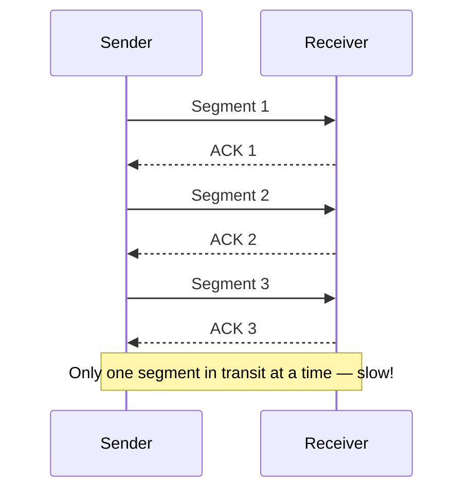
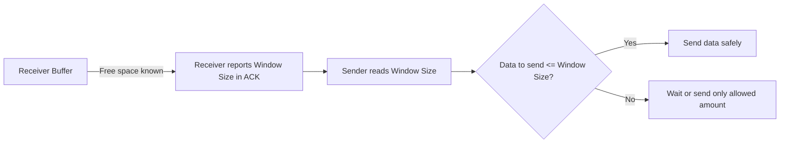
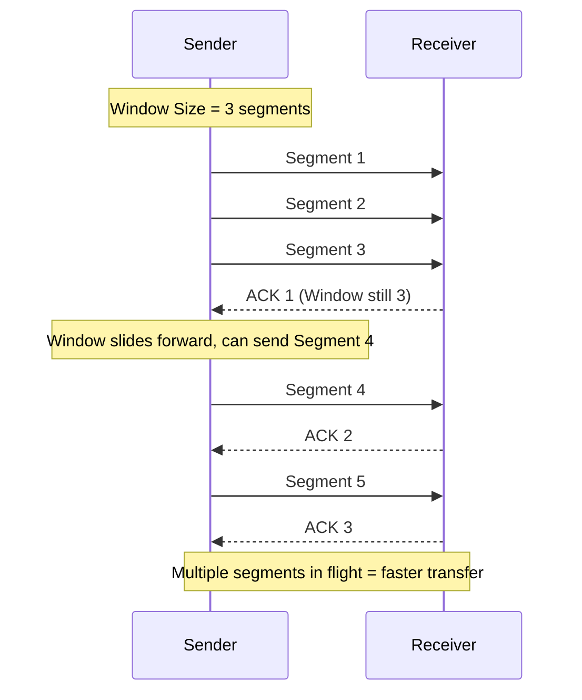
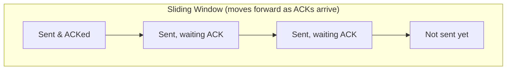
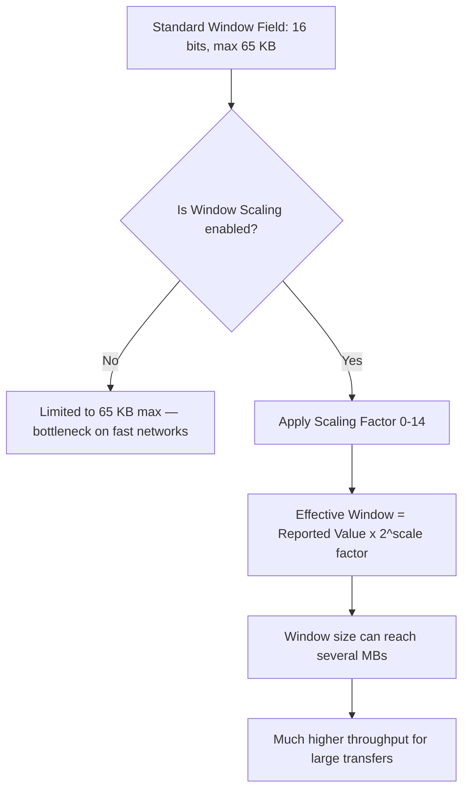
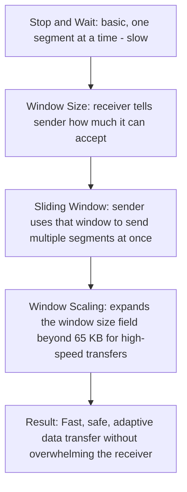

# TCP Flow Control: Stop-and-Wait, Window Size, Sliding Window & Window Scaling

Simple notes on how TCP makes sure the sender doesn't overwhelm the receiver while sending data.

---

## Why Flow Control is Needed

**Simple meaning:** The receiver has a limited memory area (called a **buffer**) to hold incoming data before the app on the receiving side reads it. If the sender sends data too fast, the buffer fills up and data gets **dropped**.

**Flow control** is TCP's way of making the sender send only as much data as the receiver can currently handle — so nothing gets lost.

---

## 1. Stop and Wait

**Simple meaning:** The most basic method. The sender sends **one segment**, then **stops** and **waits** for an acknowledgment (ACK) before sending the next one.

**Key Points:**

- One segment sent at a time
- Sender waits for ACK before sending next segment
- Very safe (receiver never gets overwhelmed) but **very slow**
- Wastes time — the sender sits idle waiting instead of sending more data
- Bad for large file transfers

---

## 2. Flow Control & Window Size

**Simple meaning:** Instead of sending one segment at a time, the receiver tells the sender exactly **how much data (in bytes) it can accept right now**. This value is called the **Window Size**, and it's carried in the TCP header of every ACK.

- The receiver's buffer has limited free space
- With every ACK, the receiver also reports its current free buffer space
- Sender must **never send more data than the receiver's window size** allows
- This directly prevents overwhelming the receiver

**Key Points:**

- Window Size = how many bytes the receiver can accept right now
- Sent inside the TCP header, updated every ACK
- Sender must respect this limit
- Protects the receiver's buffer from overflowing

---

## 3. Sliding Window Technique

**Simple meaning:** Instead of waiting for one ACK before sending the next single segment (like Stop-and-Wait), the sender can send **multiple segments at once**, up to the limit of the receiver's current window size. As ACKs come back, the "window" of allowed data **slides forward**, letting the sender keep sending more.

- Sender doesn't wait for each individual ACK — it can have several segments "in flight"
- The window size can also **shrink or grow** as the receiver's buffer fills up or empties out
- This makes data transfer much faster than Stop-and-Wait, while still protecting the receiver

**Key Points:**

- Multiple segments can be sent before waiting for ACKs
- The "window" slides forward as ACKs arrive
- Window size updates dynamically based on receiver's buffer status
- Much more efficient than Stop-and-Wait

---

## 4. Window Scaling

**Simple meaning:** The original Window Size field in the TCP header is only **16 bits**, so it can only represent a maximum value of about **65 KB**. For fast modern networks and big file transfers, 65 KB is way too small and slows things down. **Window Scaling** is a trick to allow much bigger window sizes.

- Standard window size field: 16 bits → max ~65 KB
- Window Scaling adds a **scaling factor** (a number from 0 to 14)
- The actual window size = reported window size × 2^(scaling factor)
- This allows window sizes up to several **MBs**, greatly increasing throughput
- Both sender and receiver agree to use scaling during the initial TCP handshake

**Key Points:**

- Problem: 16-bit field limits window to ~65 KB
- Solution: Scaling factor (0–14) multiplies the effective window size
- Enables window sizes of several megabytes
- Negotiated once, during the TCP handshake
- Big boost for large file transfers on fast networks

---

## How All Four Concepts Connect

---

## Quick Summary Table

| Concept                  | What it Solves                        | Key Idea                                                     |
| ------------------------ | ------------------------------------- | ------------------------------------------------------------ |
| **Stop and Wait**  | Basic reliability                     | Send one segment, wait for ACK — safe but slow              |
| **Window Size**    | Prevents overwhelming receiver        | Receiver tells sender how many bytes it can accept           |
| **Sliding Window** | Speed problem of Stop-and-Wait        | Send multiple segments at once, window slides as ACKs arrive |
| **Window Scaling** | 16-bit field is too small (max 65 KB) | Scaling factor (0-14) allows window sizes up to several MBs  |

**One-line takeaway:** TCP starts with the simple (but slow) idea of sending one segment at a time, then improves it with a Window Size that tells the sender the receiver's limit, a Sliding Window that lets multiple segments flow at once, and Window Scaling that removes the old 65 KB ceiling so modern fast networks can be fully used.
