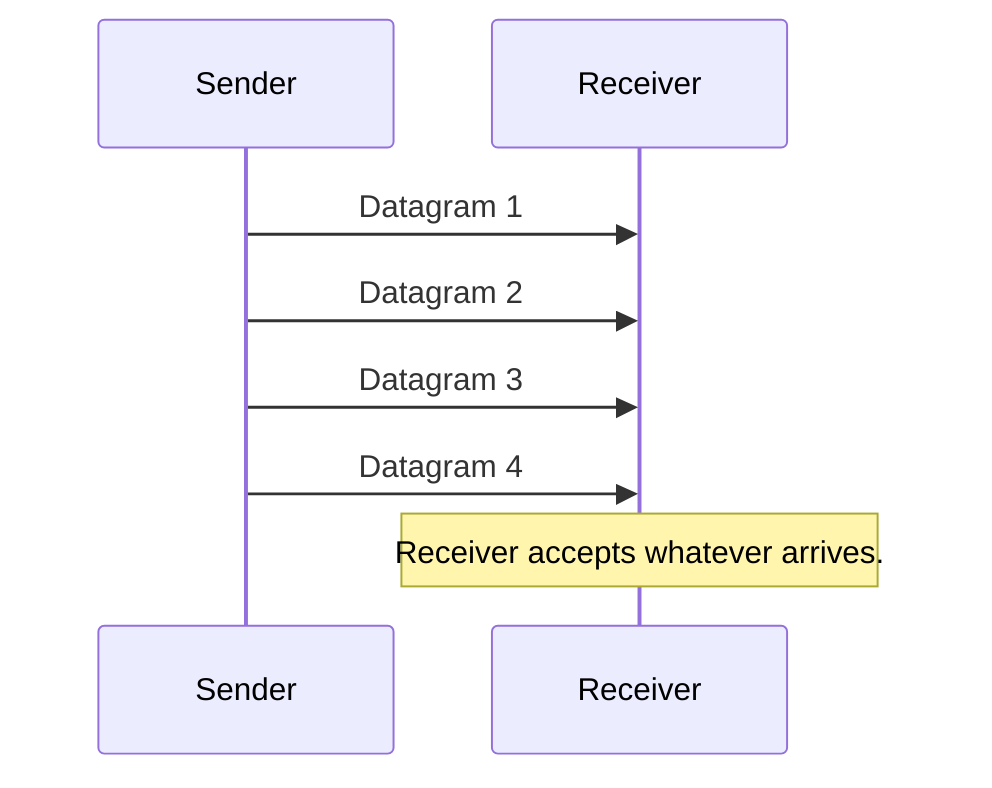
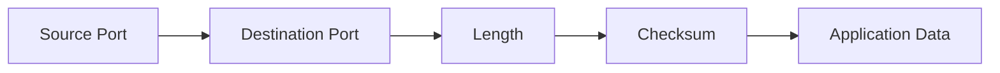
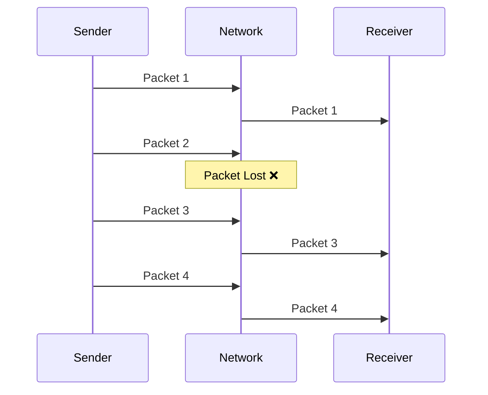

# 📡 User Datagram Protocol (UDP)

> **Layer:** Transport Layer (Layer 4 - OSI Model)
>
> **Protocol Number:** 17
>
> **Connection Type:** Connectionless
>
> **Reliability:** No
>
> **Speed:** Very Fast

---

# What is UDP?

**UDP (User Datagram Protocol)** is a lightweight transport layer protocol that sends data without establishing a connection between the sender and receiver.

Unlike TCP, UDP does not:

- Establish a connection (No 3-Way Handshake)
- Guarantee delivery
- Guarantee packet order
- Retransmit lost packets
- Perform flow control
- Perform congestion control

Because of this, UDP is **much faster than TCP**.

---

# Why UDP is Fast?

UDP simply creates a packet and sends it.

```
Application
      │
      ▼
Transport Layer (UDP)
      │
      ▼
Internet Layer (IP)
      │
      ▼
Network
```

There is no waiting for acknowledgements.

No connection setup.

No retransmission.

Less overhead.

---

# UDP Communication



---

# Connectionless Communication

Unlike TCP, UDP never checks whether the receiver is ready.


No connection establishment.

No session maintenance.

---

# UDP Header

UDP has one of the smallest headers.

Total Header Size = **8 Bytes**

```
 0      15 16      31
+---------+---------+
| Source Port       |
+---------+---------+
| Destination Port  |
+---------+---------+
| Length            |
+---------+---------+
| Checksum          |
+---------+---------+
|      Data         |
+-------------------+
```

---

# UDP Header Fields

## 1. Source Port (16 bits)

Identifies the sender's application.

Example:

```
Chrome
Port: 53021
```

---

## 2. Destination Port (16 bits)

Identifies the receiving application.

Example:

```
DNS Server
Port: 53
```

---

## 3. Length (16 bits)

Stores the total size of

- UDP Header
- UDP Data

Minimum = 8 Bytes

---

## 4. Checksum (16 bits)

Used for basic error detection.

If the checksum fails,

The receiver simply discards the packet.

No retransmission occurs.

---

# UDP Packet Structure



---

# Packet Loss

Suppose four packets are sent.

```
P1
P2
P3
P4
```

During transmission,

```
P2 ❌ Lost
```

Receiver gets

```
P1
P3
P4
```

UDP **does not request P2 again.**

---



---

# Why Doesn't UDP Retransmit?

Because retransmission causes

- Delay
- Extra bandwidth usage
- Increased latency

Many real-time applications prefer **speed over perfect accuracy.**

Receiving slightly incomplete data is better than waiting.

---

# Applications of UDP

## 1. WebRTC

Used for

- Video Calls
- Voice Calls
- Screen Sharing

Reason:

Real-time communication.

A lost frame is acceptable.

Waiting for retransmission would freeze the call.

---

## 2. Computer Games

Examples

- PUBG
- Valorant
- Counter Strike
- Fortnite

Reason

Players need the latest game state.

Old packets become useless.

---

## 3. Video Streaming

Examples

- Live Sports
- YouTube Live
- Twitch

Reason

Missing one frame is acceptable.

Buffering every missing frame causes lag.

---

## 4. VPN

Many VPNs use UDP because

- Faster tunnelling
- Lower latency
- Better performance

Example

OpenVPN UDP Mode

WireGuard

---

## 5. DNS

When you type

```
google.com
```

Your computer sends a DNS request using UDP.

Reason

DNS requests are very small.

A connection setup would waste time.

---

## 6. QUIC Protocol

Google developed QUIC on top of UDP.

HTTP/3 is built on QUIC.

QUIC provides

- Faster connection setup
- Better encryption
- Reduced latency

---

# UDP vs TCP

| Feature            | UDP       | TCP          |
| ------------------ | --------- | ------------ |
| Connection         | No        | Yes          |
| Reliable           | No        | Yes          |
| Ordered Delivery   | No        | Yes          |
| Acknowledgement    | No        | Yes          |
| Retransmission     | No        | Yes          |
| Speed              | Very Fast | Slower       |
| Header Size        | 8 Bytes   | 20–60 Bytes |
| Flow Control       | No        | Yes          |
| Congestion Control | No        | Yes          |

---

# Advantages

✅ Very Fast

✅ Low Latency

✅ Small Header

✅ Minimal Overhead

✅ Excellent for Real-Time Applications

---

# Disadvantages

❌ No Reliability

❌ Packet Loss

❌ No Packet Ordering

❌ No Error Recovery

❌ No Congestion Control

---

# Interview Questions

### What is UDP?

UDP is a connectionless transport layer protocol that sends data without establishing a connection and without guaranteeing delivery.

---

### Why is UDP faster than TCP?

Because it does not perform

- Connection setup
- Acknowledgements
- Retransmissions
- Flow control
- Congestion control

---

### What is the UDP Header Size?

**8 Bytes**

---

### Does UDP guarantee delivery?

No.

---

### Does UDP retransmit lost packets?

No.

---

### What happens if one packet is lost?

UDP simply drops it.

The receiver never requests it again.

---

### Which protocol does DNS use?

Mostly UDP.

---

### Which HTTP version uses UDP?

HTTP/3 (through QUIC).

---

### Why do games use UDP?

Games require very low latency.

Receiving the latest position is more important than receiving every packet.

---

# Summary

- UDP is a Transport Layer protocol.
- It is connectionless.
- Header size is only 8 bytes.
- It provides no reliability.
- It does not retransmit lost packets.
- It is extremely fast.
- It is widely used in WebRTC, online games, DNS, VPNs, live streaming, and QUIC (HTTP/3).
