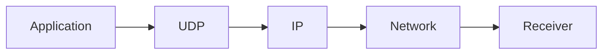
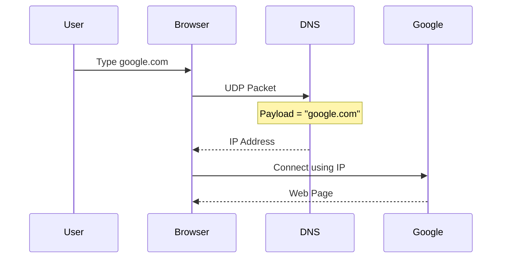
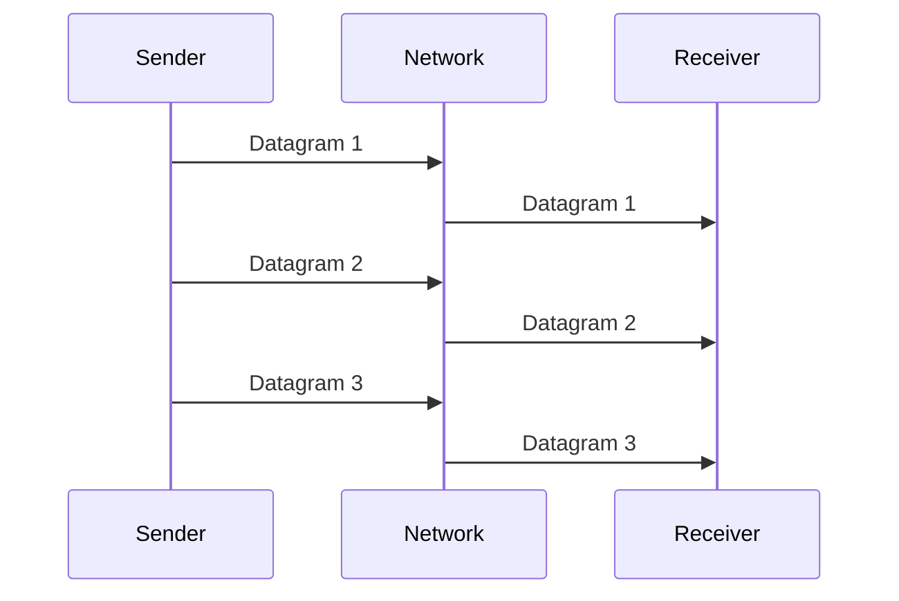
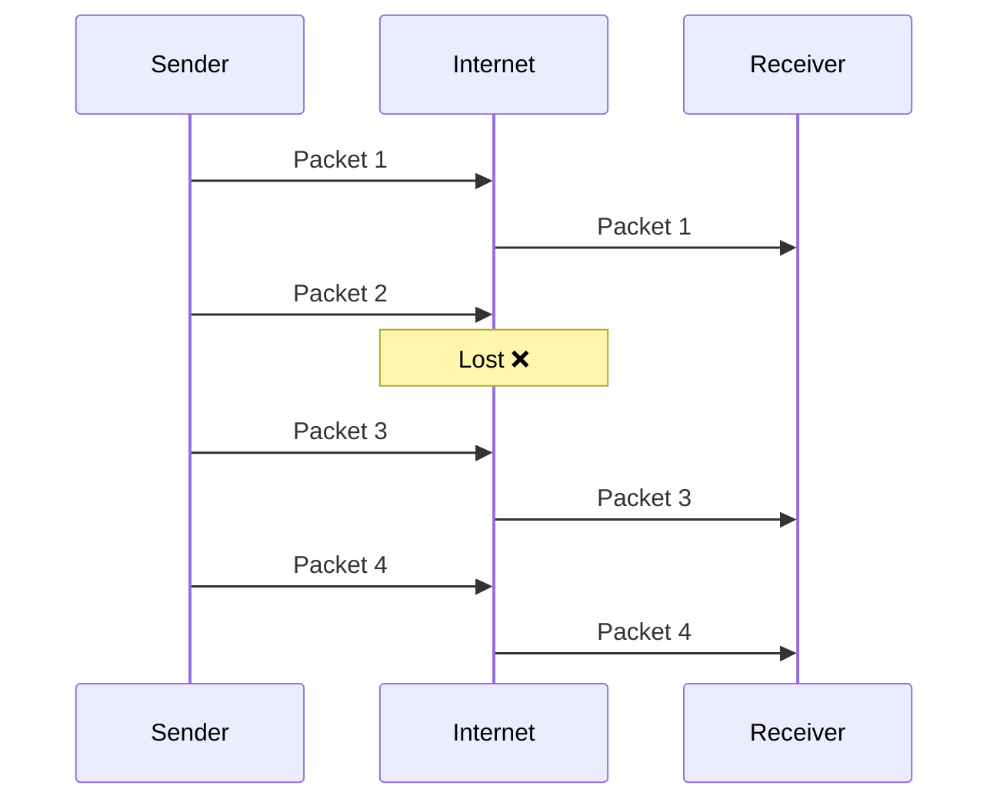
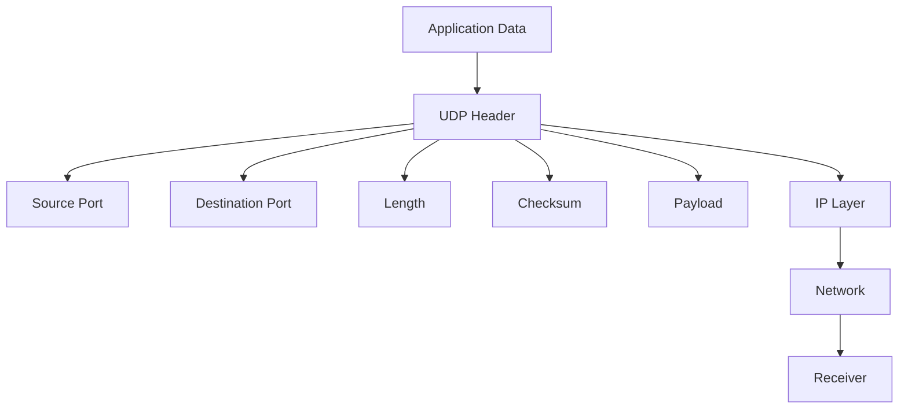

# 📡 User Datagram Protocol (UDP)

> **Date Learned:** 26 July 2026
>
> **OSI Layer:** Transport Layer (Layer 4)
>
> **Protocol Number:** 17
>
> **Connection Type:** Connectionless
>
> **Reliable:** ❌ No
>
> **Header Size:** 8 Bytes

---

# 📖 What is UDP?

**UDP (User Datagram Protocol)** is a transport layer protocol used to send data from one device to another **without creating a connection first**.

Unlike TCP, UDP simply sends the data and does not care whether the receiver actually receives it.

Because UDP performs very little work, it is **very fast**.

---

# Why Do We Use UDP?

UDP is used when **speed is more important than reliability**.

For example:

- Video Calls
- Online Games
- DNS
- Live Streaming
- Voice Calls
- VPN
- QUIC (HTTP/3)

In these applications, losing one or two packets is better than waiting for retransmission.

---

# UDP Communication



UDP simply creates a datagram and sends it.

---

# What is a Datagram?

A **Datagram** is a complete UDP packet.

A UDP Datagram contains two parts:

1. Header
2. Data (Payload)

```text
+----------------+
| UDP Header     |
+----------------+
| Payload (Data) |
+----------------+
```

---

# UDP Datagram Structure

The UDP Header is **8 Bytes**.

```text
 0                15 16               31
+------------------+------------------+
|   Source Port    | Destination Port |
+------------------+------------------+
|      Length      |     Checksum     |
+------------------+------------------+
|                                      |
|            Data (Payload)            |
|                                      |
+--------------------------------------+
```

---

# UDP Header Fields

## 1️⃣ Source Port

**Size:** 2 Bytes (16 bits)

The source port identifies **which application sent the data**.

Example

```
Chrome Browser

Source Port = 54321
```

The operating system usually assigns this port automatically.

---

## 2️⃣ Destination Port

**Size:** 2 Bytes (16 bits)

The destination port tells the receiver **which application should receive the packet.**

Example

```
DNS Server

Destination Port = 53
```

When the packet reaches the destination computer, the operating system checks this port and delivers the data to the correct application.

---

## 3️⃣ Length

**Size:** 2 Bytes (16 bits)

The Length field stores the total size of the UDP Datagram.

It includes:

- UDP Header
- Payload (Data)

Formula

```
Length = Header + Data
```

Example

```
Header = 8 Bytes

Data = 40 Bytes

Length = 48 Bytes
```

---

## 4️⃣ Checksum

**Size:** 2 Bytes (16 bits)

The checksum is used to detect whether the packet became corrupted during transmission.

Sender calculates the checksum.

Receiver calculates it again.

If both values match,

✅ Packet is accepted.

If not,

❌ Packet is discarded.

UDP **does not ask for retransmission**.

---

# What is Payload (Data)?

The **Payload** is the actual information that the application wants to send.

Everything that the application sends is stored inside the **Data field**.

```
UDP Header
↓

Source Port
Destination Port
Length
Checksum

↓

Payload
```

---

# Example 1

Suppose you type

```
google.com
```

inside your browser.

Before opening Google, your computer first sends a DNS request.

DNS generally uses UDP.

The UDP Datagram looks like this.

```text
+----------------------+
| Source Port = 55000  |
+----------------------+
| Destination Port=53  |
+----------------------+
| Length               |
+----------------------+
| Checksum             |
+----------------------+
| google.com           |
+----------------------+
```

Notice that

```
google.com
```

is the **Payload (Data)**.

The DNS server reads the payload and replies with Google's IP address.

---

# DNS Request Flow



---

# Another Example

Suppose you send

```
Hello
```

using a chat application.

The UDP Datagram becomes

```text
+------------------+
| Source Port      |
+------------------+
| Destination Port |
+------------------+
| Length           |
+------------------+
| Checksum         |
+------------------+
| Hello            |
+------------------+
```

The payload is

```
Hello
```

---

# Packet Transmission



UDP simply sends packets.

No acknowledgement is required.

---

# Packet Loss

Suppose four packets are sent.

```
Packet 1
Packet 2
Packet 3
Packet 4
```

Packet 2 gets lost.



Receiver gets

```
Packet 1

Packet 3

Packet 4
```

Packet 2 is never requested again.

---

# Why Doesn't UDP Retransmit?

Because retransmission would

- Increase delay
- Increase latency
- Reduce speed

Real-time applications prefer

```
Fast Data

instead of

Perfect Data
```

---

# Real-Life Applications

## 🌐 DNS

Payload

```
google.com
```

Destination Port

```
53
```

---

## 🎮 Online Games

Examples

- PUBG
- Valorant
- Counter Strike

Reason

Latest position is more important than old packets.

---

## 📹 Video Streaming

Examples

- YouTube Live
- Twitch
- IPL Live

Reason

Missing one frame is acceptable.

Waiting for retransmission causes buffering.

---

## 📞 Voice Calls

Examples

- WhatsApp Calls
- Discord
- Zoom
- Google Meet

Reason

Voice should arrive immediately.

---

## 🌍 VPN

Many VPNs use UDP because it provides

- Faster communication
- Lower latency

---

## ⚡ QUIC

HTTP/3 is built on QUIC.

QUIC uses UDP underneath.

It provides

- Faster loading
- Better performance
- Lower latency

---

# Advantages

✅ Very Fast

✅ Small Header (8 Bytes)

✅ Low Latency

✅ Less Network Overhead

✅ Best for Real-Time Communication

---

# Disadvantages

❌ No Reliability

❌ No Packet Ordering

❌ No Acknowledgement

❌ No Retransmission

❌ Packet Loss Possible

---

# UDP Summary Diagram



---

# Key Points to Remember

- UDP stands for **User Datagram Protocol**.
- UDP works at the **Transport Layer**.
- UDP is **connectionless**.
- A UDP packet is called a **Datagram**.
- UDP Header size is **8 Bytes**.
- Header contains **Source Port, Destination Port, Length, and Checksum**.
- The **Data field contains the Payload**.
- Example: In a DNS request, if you search **google.com**, then **google.com is stored inside the Payload (Data)**.
- UDP does not provide acknowledgements or retransmissions.
- UDP is mainly used where **speed is more important than reliability**.

---

# Interview Questions

### What is UDP?

UDP is a connectionless transport layer protocol used to send data quickly without guaranteeing delivery.

---

### What is a UDP Datagram?

A UDP Datagram is a UDP packet consisting of a **Header** and a **Payload (Data)**.

---

### What are the fields in the UDP Header?

- Source Port
- Destination Port
- Length
- Checksum

---

### What is the size of each UDP Header field?

Each field is **2 Bytes (16 bits)**.

---

### What is the total UDP Header size?

**8 Bytes**

---

### What is Payload?

Payload is the actual data sent by the application.

Example:

```
google.com
```

inside a DNS request is the Payload.

---

### What is stored in the Data field?

The application's actual message.

Examples:

- google.com
- Hello
- Voice Data
- Video Frames
- Game Data

---

### Which protocol commonly uses UDP to resolve domain names?

**DNS**

---

### Which HTTP version uses UDP?

**HTTP/3 (QUIC)**

---
