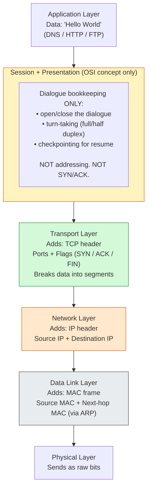
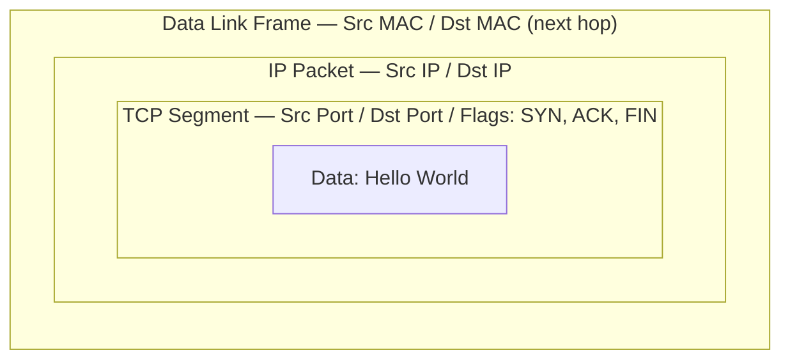

# Session Layer vs Transport/Network/Data Link — Clarified

## Core Point (1 line)

**Session layer manages the *dialogue*. It does NOT handle addressing (IP/MAC) or the real connection (SYN/ACK). Those belong to lower layers.**

---

## Diagram 1 — What Actually Gets Added at Each Layer

---

## Diagram 2 — Encapsulation (Boxes Inside Boxes)

**Reading this:** SYN/ACK flags live *inside* the TCP header. That header sits *inside* the IP packet. That packet sits *inside* the MAC frame. Nothing about Session layer appears anywhere in this stack — because it adds no header at all.

---

## Key Points

| Layer         | Adds                | Handles SYN/ACK? | Handles IP? | Handles MAC? |
| ------------- | ------------------- | ---------------- | ----------- | ------------ |
| Session (OSI) | Nothing (no header) | ❌               | ❌          | ❌           |
| Transport     | TCP/UDP header      | ✅               | ❌          | ❌           |
| Network       | IP header           | ❌               | ✅          | ❌           |
| Data Link     | MAC frame           | ❌               | ❌          | ✅           |

**Session layer's 3 real jobs (theory only):**

1. Open / close the dialogue
2. Turn-taking — full-duplex (both talk anytime) vs half-duplex (one at a time)
3. Checkpointing — resume from last confirmed point instead of restarting

**In real-world TCP/IP (the 4-layer model actually used):**

- Session + Presentation are folded into **Application** — no separate code runs for them.
- "Session" in everyday use means either:
  - a **TCP connection's lifetime** (Transport layer thing), or
  - an **app-level login session** / cookie (Application layer thing)
- Neither of those is OSI Layer 5 — they just borrow the word.

**As a DevOps engineer, you'll work with:** Transport (TCP/UDP, ports) → Network (IP, routing) → Application (HTTP, DNS, TLS). Session layer is a teaching concept, not something you'll configure or debug directly.
