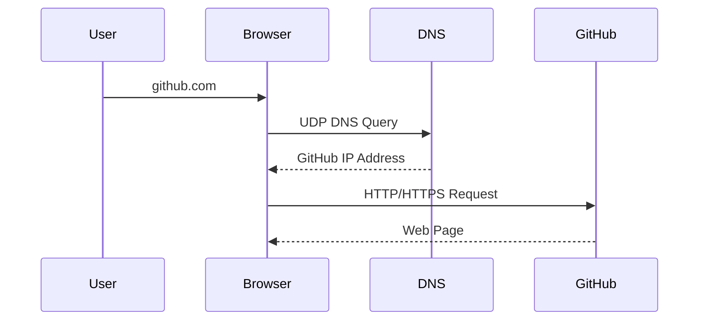
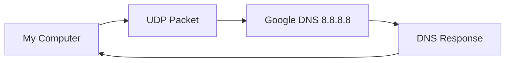
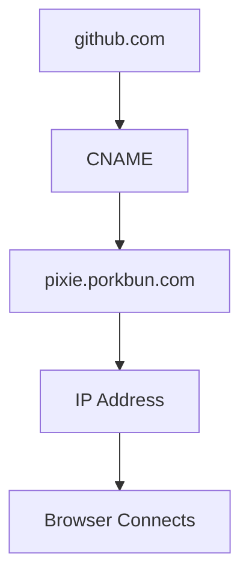
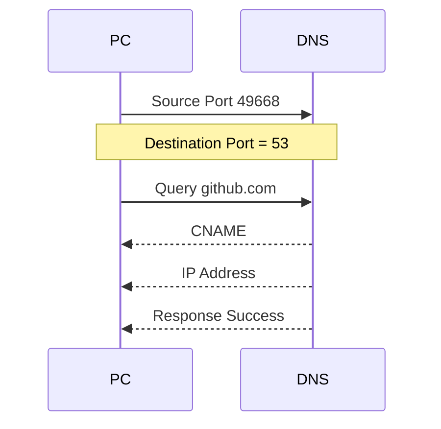
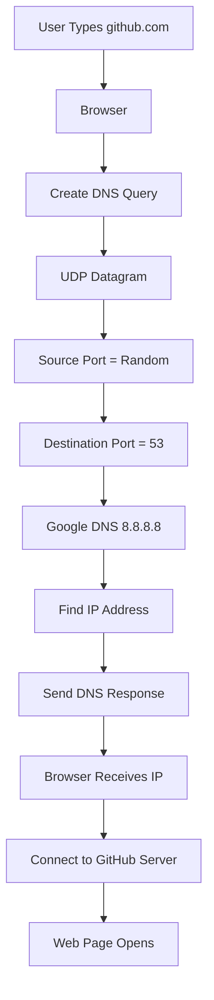

# 🌐 DNS over UDP - Wireshark Practical Lab

> **Date:** 26 July 2026
>
> **Topic:** DNS over UDP
>
> **Tools Used**
>
> - Wireshark
> - Windows Command Prompt
> - nslookup
> - Google Public DNS (8.8.8.8)

---

# 🎯 Objective

The goal of this practical was to understand how **DNS works over UDP** by capturing packets in Wireshark.

During this lab I learned

- How DNS sends requests
- Why DNS uses UDP
- What data is inside a UDP packet
- Source Port
- Destination Port
- DNS Query
- DNS Response
- CNAME Record
- A Record
- AAAA Record

---

# What is DNS?

DNS stands for

**Domain Name System**

Humans remember

```
github.com
```

Computers understand

```
140.82.121.4
```

DNS converts

```
Domain Name
      ↓
IP Address
```

---

# Complete DNS Flow



---

# Practical Command

I used

```bash
nslookup github.com 8.8.8.8
```

Explanation

```
nslookup
```

DNS lookup command.

```
github.com
```

The domain to resolve.

```
8.8.8.8
```

Google Public DNS Server.

---

# Output

```
Server:
dns.google

Address:
8.8.8.8

Non-authoritative answer

Addresses

207.xxx.xxx.xxx
207.xxx.xxx.xxx
```

This means

My computer asked Google's DNS server

> "What is the IP address of github.com?"

The DNS server replied with the IP addresses.

---

# Why did I use 8.8.8.8?

Normally,

Windows uses your ISP's DNS server.

In this practical,

I directly queried Google's DNS Server.

```
My PC
    │
    ▼
Google DNS (8.8.8.8)
    │
    ▼
Returns IP Address
```

---

# Capturing Packets in Wireshark

I started Wireshark and captured packets on my Wi-Fi interface.

Filter used

```
ip.dst == 8.8.8.8 or ip.src == 8.8.8.8
```

This filter only shows traffic between

```
My Computer

and

Google DNS
```

---

# Captured Packets

The capture showed

```
DNS Query

↓

DNS Response
```

Exactly as expected.

---

# Packet Flow



---

# DNS Query Packet

The first packet was

```
192.168.1.5

↓

8.8.8.8
```

Protocol

```
DNS
```

Inside Wireshark

```
UDP

Source Port

49668

Destination Port

53
```

Destination Port

```
53
```

means

The packet is going to the DNS service.

---

# UDP Header Analysis

From Wireshark

```
Source Port

49668
```

This is a temporary (ephemeral) port chosen by Windows.

```
Destination Port

53
```

Port 53 is reserved for DNS.

---

# Datagram Structure

```text
+----------------------+
| Source Port          |
+----------------------+
| Destination Port     |
+----------------------+
| Length               |
+----------------------+
| Checksum             |
+----------------------+
| DNS Payload          |
+----------------------+
```

---

# Payload

The UDP payload contains the DNS message.

Inside that DNS message was the query for

```
github.com
```

This is the actual application data carried by UDP.

So

```
UDP

↓

Header

↓

DNS Query

↓

github.com
```

The payload changes depending on the application.

Examples

DNS

```
github.com
```

Chat Application

```
Hello
```

Game

```
Player Position
```

Video Call

```
Audio / Video Frames
```

---

# DNS Response

The second packet came from

```
8.8.8.8

↓

192.168.1.5
```

This packet contained

- DNS Answer
- IP Address
- CNAME Record

Wireshark showed

```
Standard Query Response

No Error
```

Meaning

The DNS server successfully found the record.

---

# CNAME Record

The response showed

```
github.com

↓

pixie.porkbun.com
```

This is called a

**Canonical Name (CNAME)**

It means

```
github.com

actually points to

pixie.porkbun.com
```

Then

```
pixie.porkbun.com

↓

IP Address
```

---

# DNS Resolution Flow



---

# Request and Response



---

# Important Observation

The request

```
192.168.1.5

↓

8.8.8.8
```

The response

```
8.8.8.8

↓

192.168.1.5
```

Notice

The source and destination addresses become opposite.

---

# Why UDP?

DNS requests are usually very small.

Using TCP would require

- Connection Setup
- ACK
- Extra Packets

UDP simply sends

```
Query

↓

Response
```

which is much faster.

---

# What I Learned

✅ DNS generally uses UDP.

✅ DNS uses Port 53.

✅ UDP Header contains

- Source Port
- Destination Port
- Length
- Checksum

✅ The actual DNS query is stored inside the UDP payload.

✅ Wireshark can capture and decode DNS packets.

✅ Source Port is chosen dynamically.

✅ Destination Port 53 identifies DNS.

✅ DNS responses can contain

- A Record
- AAAA Record
- CNAME Record

---

# Interview Questions

## Why does DNS use UDP?

Because DNS messages are small and require very low latency.

UDP is faster because there is no connection setup.

---

## Which port does DNS use?

```
53
```

---

## What was the Source Port?

```
49668
```

This was dynamically assigned by the operating system.

---

## What is stored inside the UDP Payload?

The DNS Query.

Example

```
github.com
```

---

## Why is the Source Port different every time?

Because Windows assigns a temporary **ephemeral port** for each request.

---

## Why did the response come from Port 53?

Because the DNS server listens on Port 53 and replies from the same service port.

---

# Final Summary



---

# Conclusion

In this practical, I successfully captured real DNS packets using **Wireshark** and verified the results with the **`nslookup`** command.

I observed how a DNS request is encapsulated inside a UDP datagram, how the operating system assigns a temporary source port, how the DNS server listens on destination port **53**, and how the server responds with records such as **A**, **AAAA**, and **CNAME**. This practical helped me understand how DNS resolution works over UDP in real-world network communication.
