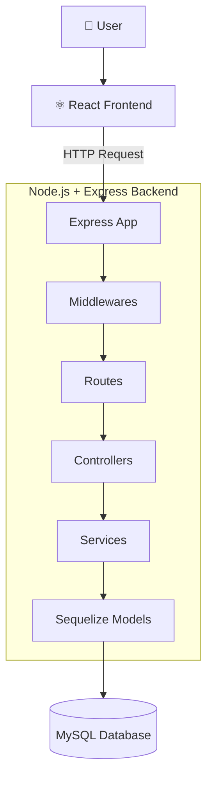
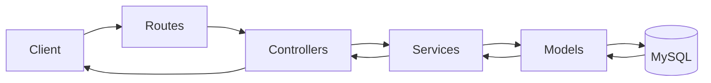
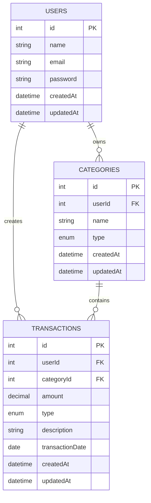
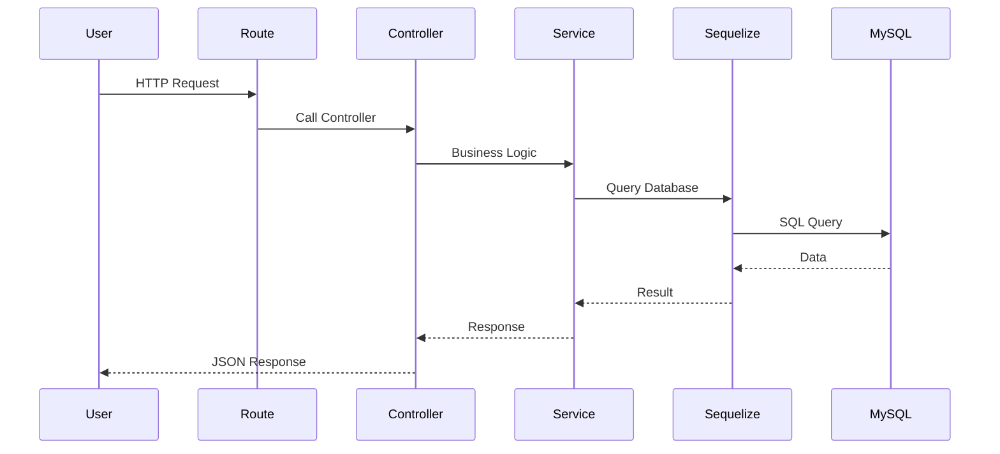
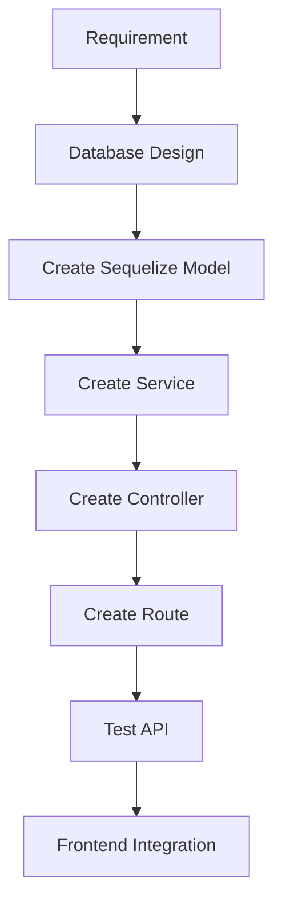

# 🏦 Expense Tracker - Project Architecture

> Backend Learning Project using **Node.js + Express + Sequelize + MySQL**

---

# 📌 Tech Stack

| Layer           | Technology |
| --------------- | ---------- |
| Frontend        | React      |
| Backend         | Node.js    |
| Framework       | Express.js |
| ORM             | Sequelize  |
| Database        | MySQL      |
| API Testing     | Postman    |
| Version Control | Git        |

---

# 🏗 Overall Application Architecture



---

# 🔄 Backend Request Flow



---

# 🗄 Database ER Diagram



---

# 🚀 API Flow



---

# 📂 Folder Structure

```text
expense-tracker/
│
├── src/
│
│   ├── config/
│   │      database.js
│   │
│   ├── models/
│   │      user.model.js
│   │      category.model.js
│   │      transaction.model.js
│   │      index.js
│   │
│   ├── controllers/
│   │      user.controller.js
│   │      category.controller.js
│   │      transaction.controller.js
│   │
│   ├── services/
│   │      user.service.js
│   │      category.service.js
│   │      transaction.service.js
│   │
│   ├── routes/
│   │      user.routes.js
│   │      category.routes.js
│   │      transaction.routes.js
│   │
│   ├── middlewares/
│   │
│   ├── utils/
│   │
│   ├── app.js
│   │
│   └── server.js
│
├── docs/
│
├── .env
│
├── package.json
│
└── README.md
```

---

# 📁 Application Modules

```text
Expense Tracker

│

├── Authentication (Optional)

│

├── Users

│      ├── Create User

│      ├── Update User

│      ├── Delete User

│      └── Get Users

│

├── Categories

│      ├── Create Category

│      ├── Update Category

│      ├── Delete Category

│      └── Get Categories

│

├── Transactions

│      ├── Add Transaction

│      ├── Update Transaction

│      ├── Delete Transaction

│      ├── Get Transactions

│      └── Filter Transactions

│

└── Reports

       ├── Total Income

       ├── Total Expense

       ├── Current Balance

       ├── Monthly Report

       ├── Category Wise Spending

       ├── Highest Expense

       ├── Lowest Expense

       └── Top Spending Categories
```

---

# 🎯 Development Workflow



---

# ✅ Project Goal

By completing this project, you should be able to:

- Design a relational database
- Build REST APIs with Express
- Use Sequelize associations
- Implement CRUD operations
- Generate reports
- Structure a scalable backend
- Connect a React frontend to the backend
